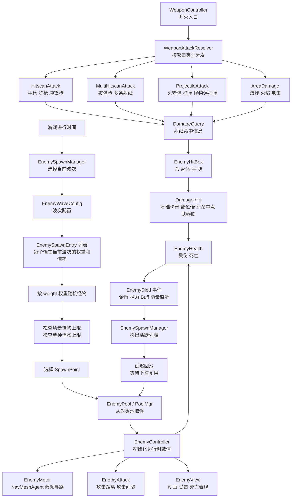
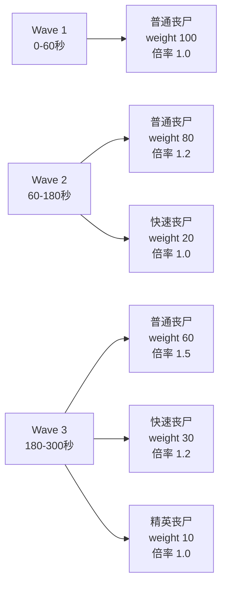
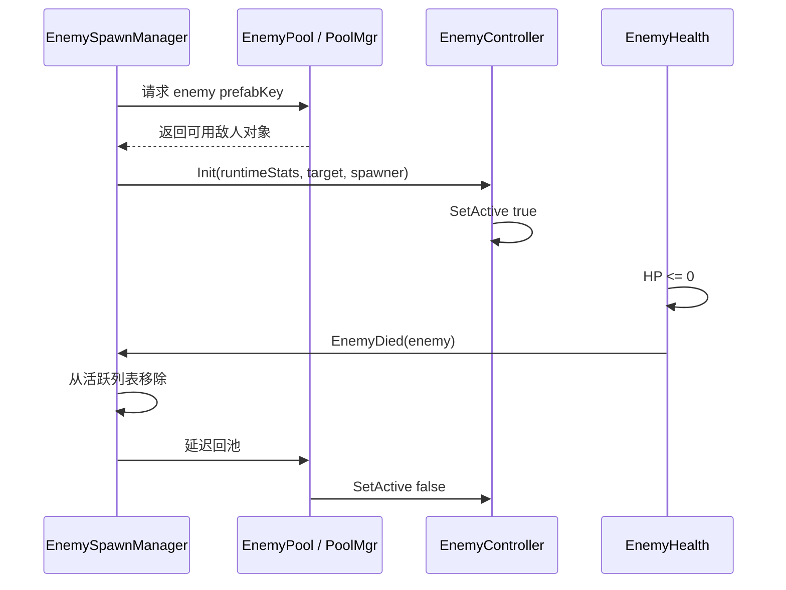
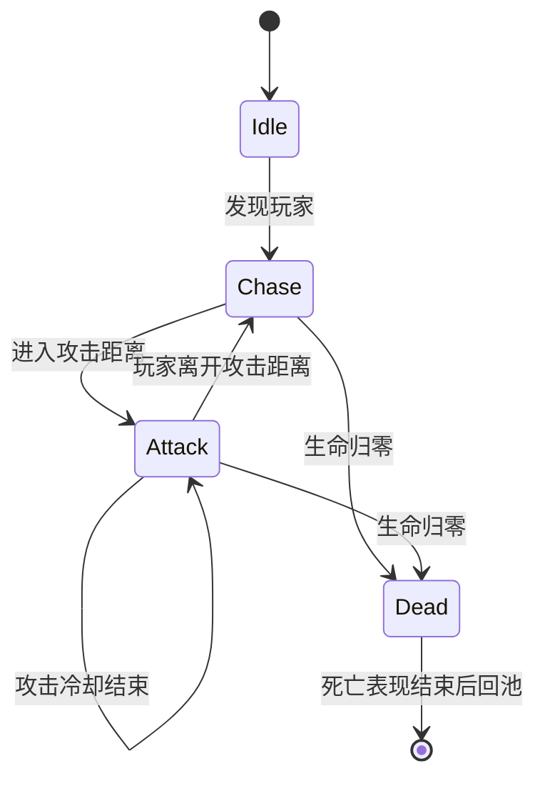
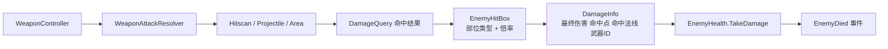

# Codex 项目交接记录

本文档用于在新的 Codex API 模式会话中快速恢复上下文。它记录当前 Unity FPSDemo 项目的目标、设计思想、关键决策、已完成内容、踩坑记录、当前代码状态和后续计划。

## 0. 给新 Codex 的快速提示词

你正在接手一个 Unity 2022.3.62f3c1 项目，路径是 `/Users/mac/unity_Git/FPSDemo/FPSDemo`，仓库路径是 `/Users/mac/unity_Git/FPSDemo`。项目是 7 天周期的单机移动端第一人称丧尸生存 FPS，不做联机。目标是做出能跑的玩法闭环：玩家移动/视角/射击/技能 -> 杀敌拾取 -> 肉鸽祝福 -> 死亡结算金币 -> 商店升级 -> 下一局。当前重点是移动端输入、UI Canvas 架构、HUD/虚拟摇杆、武器切换、APK 测试。

重要架构思想：玩家数据和武器数据分离；玩家状态机只管移动/跳跃/闪避等玩家行为；武器状态机管 Take/Idle/Fire/Reload；第一人称武器切换是替换整套 WeaponView，不是只换枪模型；UI 统一继承 BaseCanvas，不再使用 BasePanel；UI_Root 是 Overlay，不用 UICamera；OpenPanel<T>() 同步打开，OpenPanelAsy<T>() 仅 AB 异步打开；面板用 `[UICanvas(...)]` 一行声明加载来源和层级。

先读本文件后面的详细记录，再读关键代码，不要一上来大改。多会话协作时，每个会话写代码前都必须先读本文件和 `git status --short`，确认另一个会话已经写了什么。当前本地最新提交是 `914b2c2 更新移动端武器背包与切枪流程`，GitHub push 失败是因为本机凭据未配置。不要提交 `_codex_backups/`、`.DS_Store`、临时导入资源或无关 ProjectSettings。

## 1. 项目基本信息

- 项目路径：`/Users/mac/unity_Git/FPSDemo/FPSDemo`
- Git 仓库路径：`/Users/mac/unity_Git/FPSDemo`
- Unity 版本：`2022.3.62f3c1`
- 当前分支：`main`
- 当前最新本地提交：`914b2c2 更新移动端武器背包与切枪流程`
- 当前推送状态：本地 `main` 领先远端 1 个提交，但 GitHub 凭据未配置，`git push origin main` 失败
- 推送失败原因：`fatal: could not read Username for 'https://github.com': Device not configured`
- 项目目标：7 天内完成单机移动端第一人称丧尸生存 FPS 原型，不做联机

## 1.1 多会话协作规则

本项目允许同时开两个 Codex 会话，但必须共享本文件作为开发记录。

每个会话动代码前必须做三件事：

1. 先读 `CODEX_HANDOFF.md`
2. 再看 `git status --short`
3. 确认自己这次要改的文件没有和另一个会话的职责冲突

推荐分工：

- 表现层 + 控制层会话：负责 UI、移动端输入、摇杆、开火按钮、换弹按钮、开镜按钮、切枪按钮、摄像机表现、武器视图、动画表现、`PlayerController`、`WeaponController`
- 数据层会话：负责武器配置、背包数据、掉落物数据、金币、Buff、道具、局内临时数据、局外存档数据、数据事件接口

共享文件要谨慎：

- `GameEvent.cs` 属于共享事件入口，改之前先在本文件记录新增事件名和参数
- `PlayerInventory.cs` 属于数据层主文件，但表现层可以只读它的公开接口
- `WeaponController.cs` 属于控制层主文件，数据层不要直接改它的表现和输入逻辑
- `UIManager.cs` 属于表现层主文件，数据层不要改 UI 打开和布局逻辑
- `WeaponConfig.cs` 和 `WeaponConfigAsset.cs` 属于武器数据接口，两个会话都可能用，改字段前必须记录原因

每次完成一个阶段后，在本文件的“多会话工作日志”追加记录：

- 日期和会话类型
- 改了哪些系统
- 新增了哪些事件或数据字段
- 哪些文件需要另一个会话注意
- 是否通过编译

## 2. 课题理解

课题是《丧尸生存 FPS》，核心不是大型完整商业项目，而是有限周期内做出一个可演示的玩法闭环。项目定位为单机第一人称丧尸生存玩法，优先完成玩家操作、武器射击、敌人压力、局内成长和局外养成的基础闭环。

整体玩法循环：

进入关卡 -> 玩家移动、射击、释放技能 -> 击杀敌人并拾取道具 -> 获取能量并选择祝福 -> 敌人随时间增强 -> 玩家死亡或结算 -> 获得金币 -> 商店升级 -> 进入下一局

设计优先级：

1. 移动端能玩
2. 第一人称射击手感能成立
3. 武器、玩家、祝福、道具、敌人系统边界清楚
4. 能用 AB / Resources / Luban 等现有工具支撑数据和资源
5. 7 天周期内不追求过度复杂架构

## 3. 系统拆解

### 3.1 玩家系统

玩家系统负责玩家自身能力，是游戏操作体验的核心。

主要内容：

- 第一人称视角控制
- 玩家移动、跳跃、闪避
- 玩家生命、受击、死亡
- 玩家基础属性
- 玩家局内临时状态

内部模块：

- 玩家控制模块：负责玩家整体入口、输入处理、状态切换
- 玩家状态模块：负责 Idle、Move、Jump、Dodge 等状态
- 玩家运动模块：负责移动、跳跃、闪避、空中控制
- 玩家数据模块：负责生命、移动速度、跳跃高度、闪避冷却等玩家属性
- 玩家相机模块：负责第一人称视角控制

重要决策：

- 玩家数据只负责玩家自身属性，不包含武器伤害、射速、弹夹容量等武器数据
- 玩家状态机不直接控制手臂/武器动画
- 玩家第一人称视角由 `PlayerCameraController` 管
- 玩家运动细节由 `PlayerMotor` 管
- 玩家状态只负责状态切换和调用运动能力

### 3.2 武器系统

武器系统负责所有射击相关内容，与玩家数据分离。

主要内容：

- 武器类型
- 武器伤害
- 射速
- 子弹速度
- 弹夹容量
- 最大备弹
- 换弹时间
- 后坐力
- 散射
- 穿透
- 特殊攻击效果

设计决策：

- 武器不是玩家数据的一部分
- 攻击速度 +20% 这类影响射击速度或子弹速度的内容属于武器数据
- 换武器不是只换枪模型，而是替换整套第一人称 `WeaponView`
- `WeaponView` 包含手臂、武器模型、Animator、枪口点、弹壳点和特效点
- 每个武器可以有自己的 Animator Controller
- 武器动画播放由武器状态机管理，而不是玩家状态机管理

当前武器状态：

- Equip：拿出武器
- Idle：待机
- Fire：开火
- Reload：换弹

第一版已实现：

- 手枪装备时先进入 Take / Equip，再进入 Idle
- 左键开火播放 Fire 动画
- 开火扣除弹夹子弹
- 弹夹为空时不能开火
- R 键换弹播放 Reload 动画
- 换弹后补充弹夹并扣除备弹
- 使用相机中心发射 Raycast 检测命中
- 命中物体后输出命中信息
- 更新 Animator 中的 Ammo 和 Is Reloading 参数
- 开火时有相机后坐力
- 开火时有武器视图后坐力

Akila 资源使用原则：

- 使用 Akila 的美术、模型、手臂、武器动画、Animator Controller
- 不使用 Akila 的 Firearm.cs
- 不使用 Akila 的 Inventory
- 不使用 Akila 的 CharacterManager
- 不使用 Akila 的 FirstPersonController
- 不使用 Akila 的输入系统

### 3.3 技能系统

技能系统负责玩家主动技能。

规划技能：

- 炸弹
- 推开敌人
- 其他主动技能

系统需求：

- 技能冷却
- 技能释放
- 技能效果结算
- 技能被祝福改变

例子：

- 祝福可以让炸弹变为特殊投掷物
- 祝福可以让推开敌人附带伤害或眩晕
- 闪避可被祝福改造成冲撞

### 3.4 道具系统

道具系统负责场景内掉落和拾取效果。

规划道具：

- 恢复生命
- 增加子弹
- 临时提升移动速度
- 临时霸体
- 临时无限子弹
- 改变技能效果的特殊道具

道具效果会根据类型作用到玩家系统、武器系统或技能系统。

### 3.5 肉鸽祝福系统

肉鸽祝福系统负责局内成长。

设计思路：

- 玩家击杀或感知敌人获得能量
- 能量达到指定值后触发祝福选择
- 祝福只在当前一局生效
- 本局结束后祝福清空

祝福类型：

- 玩家属性强化
- 武器效果强化
- 技能形态变化
- 爆炸效果强化
- 召唤物协同攻击
- 金币收益增加

示例效果：

- 爆头击杀产生范围爆炸
- 攻击概率触发连锁闪电
- 攻击叠加印记，达到层数后爆炸
- 闪避变为冲撞技能
- 召唤物协同攻击敌人

### 3.6 敌人系统

敌人系统负责丧尸和特殊敌人的行为。

敌人类型：

- 地面近战敌人
- 地面远程敌人
- 空中敌人
- 精英敌人

系统内容：

- 生成
- 寻路
- 移动
- 攻击
- 受击
- 死亡
- 掉落
- 随时间成长

敌人的生命、伤害、数量或生成频率会随游戏时间提升，形成生存压力。

### 3.7 场景系统

场景系统负责地图环境、特殊地形和生成区域。

主要内容：

- 普通地图区域
- 敌人出生点
- 道具掉落区域
- 减速地形
- 跳跃强化地形
- 高低差区域
- 敌人寻路区域

特殊地形会影响玩家移动或敌人寻路。

### 3.8 数值系统

数值系统负责统一计算最终属性，避免各系统各自计算导致混乱。

玩家最终属性：

玩家基础配置 + 永久存档升级 + 当前局临时修正 = 玩家最终属性

武器最终属性：

武器基础配置 + 武器升级 + 当前局祝福或道具修正 = 武器最终属性

重要决策：

- 玩家数值和武器数值分开计算
- 玩家数据不碰武器
- 武器数据不放进玩家基础数据
- 最终在战斗系统中组合使用

### 3.9 存档系统

存档系统负责保存局外长期成长。

保存内容：

- 金币
- 最长生存时间
- 玩家永久升级等级
- 武器解锁状态
- 武器升级等级

不保存：

- 当前局祝福
- 当前局临时道具效果
- 当前局运行时状态

### 3.10 商店系统

商店系统负责局外成长。

金币结算依据：

- 击杀敌人数量
- 敌人类型
- 存活时间
- 金币倍率

金币用途：

- 升级玩家基础属性
- 解锁新武器
- 升级武器基础属性

### 3.11 表现反馈系统

表现反馈系统负责提升玩家操作反馈、射击反馈和战斗表现。

特效反馈：

- 武器开火特效
- 命中特效
- 爆炸特效
- 电击、燃烧等元素特效
- 玩家受击反馈
- 敌人受击反馈

音效反馈：

- 武器开火音效
- 换弹音效
- 敌人受击音效
- 敌人死亡音效
- 道具拾取音效
- UI 操作音效

画面反馈：

- 摄像机震动
- 画面后处理效果

当前想法：

- 普通 UI 暂时用 Overlay，不强求 UI Camera 后处理
- 如果后续要 UI 发光或后处理，可以做局部特效或单独 UI 相机方案，但当前 7 天项目优先稳定

## 4. 当前已完成的开发内容

### 4.1 Rider / Mono / MSBuild 问题

一开始 Rider 没有正确关联 Unity 解决方案，所有类颜色不对，原因是找不到 MSBuild。

处理过程：

- 终端里 `which mono` 和 `which msbuild` 一开始都找不到
- 后续将 Mono 路径加入 `~/.zshrc`
- 路径为：`/Library/Frameworks/Mono.framework/Versions/Current/bin`
- 之后 `which mono` 和 `which msbuild` 正常

结果：

- Rider 可以正常编译 Unity C# 项目
- 后续多次 `msbuild FPSDemo.sln /t:Build /p:Configuration=Debug` 通过

### 4.2 Luban / JSON 数据

用户计划用 Luban 生成 JSON 数据。

当前思路：

- Luban 是外部数据生成工具，不必放到 Unity 内部流程
- Mac 下不使用 Windows `.bat`
- 可以用 `.sh` 或 `.command`
- 数据输出后 Unity 只负责读取 JSON

### 4.3 AssetBundle

安装并使用了 AssetBundle Browser。

遇到过的问题：

- 打 Windows 目标 AB 时提示 `WindowsStandaloneSupport` 未安装
- 解决思路：当前平台或 Android 平台需要选择对应 Build Target
- AB 路径在 `Assets/StreamingAssets` 或指定输出目录
- 如果 AB 构建失败，运行时会报 `Unable to open archive file`

当前 AB 约定：

- UI AB 包名默认：`uipanel`
- 测试 UI 预制体：`Assets/Art/ABRes/UI/TestCanvas.prefab`

### 4.4 玩家数据结构

已将玩家数据从玩家控制逻辑中拆出。

当前玩家数据分为：

- 玩家基础配置：移动速度、跳跃高度、闪避参数、最大生命值等基础属性
- 玩家存档数据：金币、最长生存时间、永久升级等级等局外成长数据
- 玩家运行时数据：当前生命值、当前局临时倍率、无敌、霸体等局内状态
- 玩家最终属性：统一对外提供玩家最终数值

关键类：

- `PlayerBaseConfig`
- `PlayerSaveData`
- `PlayerRuntimeData`
- `PlayerStats`

设计决策：

- `PlayerStats` 是普通 C# 类，不挂载到 GameObject
- `PlayerController` 持有 `PlayerStats`
- `PlayerMotor / PlayerState / PlayerJump` 通过 `player.Stats.xxx` 读取玩家最终数值
- 不把 `WalkSpeed / RunSpeed / JumpHeight` 等一长串属性继续挂在 `PlayerController` 上做代理

### 4.5 玩家控制结构

当前玩家相关结构：

- `PlayerController`：玩家入口、状态机、玩家数据持有
- `PlayerMotor`：实际移动、跳跃、空中控制
- `PlayerCameraController`：第一人称视角、相机旋转、后坐力接口
- `PlayerState`：状态基类
- `PlayerIlde`：Idle 状态，文件名目前拼错但先未改
- `PlayerMove`：Move 状态
- `PlayerJump`：Jump 状态

重要决策：

- `PlayerState` 不应该放大量移动逻辑
- 运动通用能力放 `PlayerMotor`
- 状态只组织行为和切换
- 开枪不放玩家移动状态机里，开枪属于武器状态机

### 4.6 CameraRoot / 第一人称相机结构

当前推荐层级：

```text
Player
├── PlayerModel
├── CameraRoot
│   └── Main Camera
│       └── WeaponViewRoot
│           └── PistolView
```

含义：

- `Player` 控制身体 yaw
- `CameraRoot` 控制上下 pitch
- `Main Camera` 是实际第一人称相机
- `WeaponViewRoot` 是第一人称武器挂点
- `PistolView` 是当前手枪表现层

### 4.7 Akila FPS Framework 资源使用

导入 Akila/FPS Framework 后分析：

- 它的手臂和武器是配套的一整套第一人称动画
- 很多动画不是单独给枪或单独给手，而是整套手臂+枪一起动
- 所以如果换枪，最好替换整套 `WeaponView`
- 不建议把 Akila 的逻辑系统直接接入项目

当前使用：

- 手枪模型
- 第一人称手臂
- Default Pistol Animator Controller
- Fire / Reload / Take / Idle 等动画状态

不使用：

- Akila 的输入
- Akila 的角色控制
- Akila 的武器逻辑
- Akila 的背包/管理器

### 4.8 武器系统第一版

新增结构：

- `WeaponController`
- `WeaponView`
- `WeaponConfig`
- `WeaponRuntimeData`
- `WeaponState`
- `WeaponIdleState`
- `WeaponEquipState`
- `WeaponFireState`
- `WeaponReloadState`
- `WeaponStateType`

当前设计：

- `WeaponController` 挂 Player
- `WeaponView` 挂 PistolView
- `WeaponConfig` 普通配置类
- `WeaponRuntimeData` 普通运行时数据类
- 武器状态对象只创建一次
- 开火用 `LAttack`
- 换弹用 R，后续可接 InputSystem

已经修过的问题：

- 最初进入武器状态时直接 Idle，不符合“拿出武器”流程
- 后来改为先 Take / Equip，再进入 Idle
- `WeaponView.Init()` 不再直接 `PlayIdle()`
- `WeaponEquipState` 会播放 Take 动画并按动画长度或 fallback 时间等待

### 4.9 后坐力

后坐力分两层：

1. 相机后坐力
   - 调用 `PlayerCameraController.AddRecoil`
   - 让视角上跳和轻微左右偏移

2. 武器视图后坐力
   - `WeaponView` 内部让 PistolView 后退、上扬、回正
   - 让手臂和武器有开火反馈

注意：

- 没有 IK
- 不是靠骨骼 IK 实现
- 当前是相机角度 + 武器视图局部 Transform 动画的组合

### 4.10 输入问题

这是非常重要的坑。

问题表现：

- UI 改造后，移动可以，但视角、开枪、换弹都失效
- 用户一度怀疑是 UI / EventSystem / Mac 设置问题
- 回退到之前正确版本后仍然不行
- 新建空 Unity 项目测试 Mouse.current 正常
- 最终确认不是电脑坏，也不是 UI_Root 本身

关键原因：

- 项目里新 Input System 的某些鼠标绑定在当前项目状态下没有正常给 `CameraLook / LAttack` 等动作传值
- 但旧 Input Manager 的 `Input.GetAxis("Mouse X/Y")` 和 `Input.GetMouseButtonDown(0)` 是正常的

当前修复：

- 在 `GameInputManger` 里保留 InputSystem 入口
- 同时对鼠标视角和左键做旧输入兜底

当前约定：

- 项目仍然保留 InputSystem，后续移动端虚拟摇杆也可以走 InputSystem
- 编辑器鼠标测试先用 fallback 保证稳定
- 手机端虚拟摇杆可以后续写 UI 控件，将输入写入自定义输入层或触发 InputAction

### 4.11 移动端输入想法

用户最基本目标是手机端，不需要优先考虑手柄。

当前想法：

- 键盘/鼠标用于编辑器测试
- 后续手机端通过虚拟摇杆和触摸区域实现
- 虚拟摇杆可绑定到当前输入抽象层
- 不建议在每个系统里直接读 UI 摇杆，而是让 `GameInputManger` 或输入适配层统一暴露 Movement / CameraLook / LAttack / Reload

### 4.12 UI 系统重构

这是当前最新一轮主要内容。

旧问题：

- 原来是 `BasePanel`
- 后来想改成每个界面为一个 Canvas
- 中间出现过 UI_Root / Layer 容器也是 Canvas 的设计，但用户认为这会回到旧方式
- 最终确定：Root 和 Layer 只是容器，具体面板才是 Canvas

当前 UI 设计：

```text
UI_Root
├── SafeAreaRoot
│   ├── HUDLayer
│   ├── TouchLayer
│   ├── NormalLayer
│   ├── PopupLayer
│   └── TipLayer
└── FullScreenRoot
    └── SystemLayer
```

规则：

- `UI_Root` 是运行时基础设施
- `UI_Root` 优先从 `Resources/UI/UI_Root` 加载
- 如果 Resources 没有，则代码生成
- `UI_Root` 使用 `Screen Space - Overlay`
- 不使用 UICamera
- 不自动插入 URP Camera Stack
- Layer 只是 RectTransform 容器，不挂 Canvas
- 具体 UI 面板 prefab 自己挂 `Canvas / CanvasGroup / GraphicRaycaster / BaseCanvas`

当前 UI 基类：

- `BaseCanvas`
- `BasePanel` 已删除

当前 UI 打开接口只有两个：

```csharp
UIManager.Instance.OpenPanel<T>();
UIManager.Instance.OpenPanelAsy<T>();
```

语义：

- `OpenPanel<T>()`：同步打开，支持 Resources 或 AB
- `OpenPanelAsy<T>()`：异步打开，只允许 AB 面板

面板配置：

```csharp
[UICanvas(UILoadType.AssetBundle, UILayer.Normal)]
public class TestCanvas : BaseCanvas
{
}
```

默认规则：

- `LoadType` 默认 `Resources`
- `Layer` 默认 `Normal`
- `AssetBundleName` 默认 `uipanel`
- `AssetName` 默认类名
- `ResourcesPath` 默认 `UI/类名`
- `UseSafeArea` 默认 true

常用写法：

```csharp
[UICanvas(UILayer.HUD)]
public class HUDCanvas : BaseCanvas
{
}
```

```csharp
[UICanvas(UILoadType.AssetBundle, UILayer.Popup)]
public class ShopCanvas : BaseCanvas
{
}
```

特殊写法：

```csharp
[UICanvas(UILoadType.AssetBundle, UILayer.Popup, AssetBundleName = "ui_shop", AssetName = "ShopPanel")]
public class ShopCanvas : BaseCanvas
{
}
```

当前测试：

- `TestCanvas` 已测试可用
- AB 测试资源路径：`Assets/Art/ABRes/UI/TestCanvas.prefab`
- Resources Root 路径：`Assets/Resources/UI/UI_Root.prefab`
- 用户已测试：UI 正常生成、打开、位置正常、输入不再受影响

## 5. 当前 Git 状态

最新本地提交：

```text
914b2c2 更新移动端武器背包与切枪流程
```

最近提交记录：

```text
914b2c2 更新移动端武器背包与切枪流程
50b49c9 实现移动端触控与Android打包流程
1630b23 优化UI Canvas加载架构
5241097 修复编辑器输入兜底和武器入场状态
a74effc 实现手枪武器状态机
```

`914b2c2` 提交内容：

- 新增本局运行时背包 `PlayerInventory`
- 新增携带武器槽位 `CarriedWeaponSlot`
- 新增移动端切枪按钮 `SwitchWeaponButton`
- 武器切换保留每把枪的弹药状态
- 接入手枪和步枪配置资源
- 接入每把枪的开镜姿态数据
- 优化移动端开火、瞄准、换弹事件输入
- 更新触控 UI 布局和场景绑定

当前推送状态：

- 本地提交成功
- `main` 领先远端提交
- GitHub push 失败，因为本机 GitHub 凭据未配置
- 用户需要在终端执行：

```bash
cd /Users/mac/unity_Git/FPSDemo
git push origin main
```

注意：

- `_codex_backups/` 是备份目录，不要提交
- `.DS_Store` 不要提交
- DOTween 临时导入资源不要提交，除非明确决定项目正式使用 DOTween
- 无关 ProjectSettings 不要混进功能提交
- 如果遇到远端落后/冲突，要先确认，不要随便 reset

## 6. 已踩坑和重要约束

### 6.1 不要乱改用户未要求的代码

项目有多次临时测试、场景调整和用户手动操作。不要随便 `git reset --hard` 或 `checkout --`。

### 6.2 UI 不使用 UICamera

用户曾经想用 UI Camera 做后处理，但在 7 天周期和移动端稳定性优先下，当前决定：

- 普通 UI 用 `Screen Space - Overlay`
- 不创建 UICamera
- 不动态加入 Main Camera Stack
- 不依赖 Main Camera
- 切场景也不受 Main Camera 生命周期影响

### 6.3 EventSystem 不等于输入失效原因

输入问题曾被怀疑是 EventSystem，但最后不是。

当前仍可使用 EventSystem，但要注意：

- 如果使用新版 InputSystem UI，需要考虑 `InputSystemUIInputModule`
- 当前项目里保留旧 `StandaloneInputModule` 能跑
- 不要轻易把输入链全部改掉

### 6.4 MonoBehaviour 不能靠构造函数配置

用户曾说“继承 BaseCanvas 后重写构造函数指定加载类型”。实际 Unity 中 `MonoBehaviour` 不应使用构造函数做业务配置。

当前解决：

- 用 `[UICanvas(...)]` 属性作为简单配置
- 仍保留 `BaseCanvas` 的虚属性作为兜底

### 6.5 玩家模型与第一人称武器表现分离

不要把第一人称手臂动画塞回玩家模型状态机。

当前方向：

- 玩家状态机管移动、跳跃、闪避、死亡等玩家状态
- 武器状态机管拿枪、待机、开火、换弹等武器表现
- 第一人称手臂属于武器表现层，不是玩家运动状态的一部分

### 6.6 不做联机

本项目明确不做联机。

### 6.7 周期是 7 天

所有架构都要服务 7 天可交付，不要上过于复杂的系统。

## 7. 当前后续计划

用户近期计划：

1. 修复并稳定输入问题
   - 当前已基本解决：编辑器鼠标输入使用 fallback
   - 后续还要做手机虚拟摇杆和触摸视角

2. 优化 UI Panel 为 UI Canvas 架构
   - 当前已完成第一版
   - 已测试可用

3. 创建简单虚拟摇杆和 HUD 系统
   - 下一步很可能要做
   - 应放在 `TouchLayer` / `HUDLayer`
   - 建议 `TouchControlCanvas : BaseCanvas`
   - 建议 `HUDCanvas : BaseCanvas`

4. 枪械切换
   - 当前只有手枪
   - 后续要实现替换 `WeaponViewRoot` 下的整套 WeaponView
   - 武器数据与武器表现要分离

5. 打包 APK 测试
   - 需要 Android Build Support
   - AB 要打 Android 目标
   - 移动端输入和 UI 适配要先验证

## 8. API 模式 Codex 接手建议

接手后第一步建议：

1. 读取当前关键文件：

```text
/Users/mac/unity_Git/FPSDemo/FPSDemo/Assets/Scripts/Manager/UIManager.cs
/Users/mac/unity_Git/FPSDemo/FPSDemo/Assets/Scripts/Manager/BaseCanvas.cs
/Users/mac/unity_Git/FPSDemo/FPSDemo/Assets/Scripts/Manager/SafeAreaAdapter.cs
/Users/mac/unity_Git/FPSDemo/FPSDemo/Assets/Scripts/Input/GameInputManger.cs
/Users/mac/unity_Git/FPSDemo/FPSDemo/Assets/Scripts/Weapon/WeaponController.cs
/Users/mac/unity_Git/FPSDemo/FPSDemo/Assets/Scripts/Weapon/WeaponView.cs
/Users/mac/unity_Git/FPSDemo/FPSDemo/Assets/Scripts/Character/Player/PlayerController.cs
/Users/mac/unity_Git/FPSDemo/FPSDemo/Assets/Scripts/Character/Player/PlayerMotor.cs
```

2. 先跑编译：

```bash
cd /Users/mac/unity_Git/FPSDemo/FPSDemo
msbuild FPSDemo.sln /t:Build /p:Configuration=Debug
```

3. 不要先大改 UI / 输入 / 武器状态机

4. 如果要做手机虚拟摇杆：

- 新建 `TouchControlCanvas : BaseCanvas`
- 用 `[UICanvas(UILayer.Touch)]`
- 放 Resources 或 AB 均可，当前测试阶段建议 Resources
- 不直接改玩家移动逻辑，先把摇杆输入接到统一输入层

5. 如果要做 HUD：

- 新建 `HUDCanvas : BaseCanvas`
- 用 `[UICanvas(UILayer.HUD)]`
- HUD 不需要交互时可以 override `NeedRaycaster => false`

6. 如果要做武器切换：

- 不要只替换枪模型
- 替换整套 `WeaponView`
- 每把枪有自己的 Animator Controller 和动画状态名
- `WeaponController` 持有当前 `WeaponConfig / WeaponRuntimeData / WeaponView`

## 9. 当前用户偏好

- 用户希望解释直接、实用
- 用户不喜欢过度复杂或“看起来规范但不好用”的设计
- 用户重视架构边界，但周期短，不能为了架构牺牲进度
- 用户会频繁问“这样规范吗、性能好吗、是不是更好”
- 回答时要说明为什么当前设计适合 7 天移动端 FPS 原型
- 用户喜欢先讨论设计，再让 Codex 或 Claude 写代码
- 用户在焦虑时要直接定位问题，不要绕

## 10. 当前可复制的 UI 用法

Resources 普通面板：

```csharp
[UICanvas]
public class TestCanvas : BaseCanvas
{
}
```

HUD：

```csharp
[UICanvas(UILayer.HUD)]
public class HUDCanvas : BaseCanvas
{
    public override bool NeedRaycaster => false;
}
```

Touch：

```csharp
[UICanvas(UILayer.Touch)]
public class TouchControlCanvas : BaseCanvas
{
}
```

AB Popup：

```csharp
[UICanvas(UILoadType.AssetBundle, UILayer.Popup)]
public class ShopCanvas : BaseCanvas
{
}
```

打开：

```csharp
UIManager.Instance.OpenPanel<HUDCanvas>();
UIManager.Instance.OpenPanel<TouchControlCanvas>();
UIManager.Instance.OpenPanel<ShopCanvas>();
UIManager.Instance.OpenPanelAsy<ShopCanvas>(panel =>
{
    // AB 异步加载完成
});
```

关闭：

```csharp
UIManager.Instance.ClosePanel<ShopCanvas>();
```

## 11. 当前测试脚本状态

`Assets/Scripts/test.cs` 当前用于测试 UI：

```csharp
UIManager.Instance.OpenPanelAsy<TestCanvas>();
```

如果后续不需要，可以移除场景中的 `test` GameObject 或删除该测试脚本调用，但不要在没确认前随便删。

## 12. 重要文件速查

UI：

- `Assets/Scripts/Manager/UIManager.cs`
- `Assets/Scripts/Manager/BaseCanvas.cs`
- `Assets/Scripts/Manager/SafeAreaAdapter.cs`
- `Assets/Scripts/UI/TestCanvas.cs`
- `Assets/Resources/UI/UI_Root.prefab`
- `Assets/Art/ABRes/UI/TestCanvas.prefab`

输入：

- `Assets/Scripts/Input/GameInputManger.cs`
- `Assets/Scripts/Input/InputAcyions.cs`

玩家：

- `Assets/Scripts/Character/Player/PlayerController.cs`
- `Assets/Scripts/Character/Player/PlayerMotor.cs`
- `Assets/Scripts/Character/Player/PlayerState/PlayerState.cs`
- `Assets/Scripts/Character/Player/PlayerState/PlayerIlde.cs`
- `Assets/Scripts/Character/Player/PlayerState/PlayerMove.cs`
- `Assets/Scripts/Character/Player/PlayerState/PlayerJump.cs`
- `Assets/Scripts/Character/Player/Data/PlayerStats.cs`

武器：

- `Assets/Scripts/Weapon/WeaponController.cs`
- `Assets/Scripts/Weapon/WeaponView.cs`
- `Assets/Scripts/Weapon/Data/WeaponConfig.cs`
- `Assets/Scripts/Weapon/Data/WeaponRuntimeData.cs`
- `Assets/Scripts/Weapon/State/WeaponState.cs`
- `Assets/Scripts/Weapon/State/WeaponEquipState.cs`
- `Assets/Scripts/Weapon/State/WeaponFireState.cs`
- `Assets/Scripts/Weapon/State/WeaponReloadState.cs`

管理器：

- `Assets/Scripts/Manager/ABManager.cs`
- `Assets/Scripts/Manager/ResMgr.cs`
- `Assets/Scripts/Manager/EventCenter.cs`
- `Assets/Scripts/Manager/MonoManager.cs`

## 13. 武器攻击与敌人系统联合架构设计草案

状态：分析阶段设计文档，当前不写功能代码

目标：第三天优先推进武器攻击系统和敌人系统的联动，让当前 FPS 操作链路进入战斗闭环。普通枪械第一版使用射线命中，子弹轨迹只做表现；敌人第一版使用 Unity NavMesh，必须接对象池，支持肉鸽时间成长、波次刷新概率、场景怪物上限、死亡回池和武器部位伤害。

### 13.1 总体架构图



### 13.2 模块职责

表现层 + 控制层会话负责：

- `WeaponAttackResolver`：根据武器攻击类型选择射线、多射线、实体弹或范围伤害
- `HitscanAttack`：普通枪械即时射线命中，第一版手枪和步枪使用它
- `MultiHitscanAttack`：霰弹枪多弹丸射线，后续扩展
- `ProjectileAttack`：火箭弹、榴弹、怪物远程弹等真子弹预制体，必须走对象池，后续扩展
- `AreaDamage`：爆炸、火焰、电击等范围伤害，后续扩展
- `DamageInfo` 组装和提交：攻击系统只输出统一伤害数据，不直接改敌人具体数值逻辑
- `EnemySpawnManager`：刷怪调度、当前波次选择、场景怪物上限、活跃怪物列表
- `EnemyPool`：敌人对象复用，死亡后回池，避免频繁创建和销毁
- `EnemyController`：敌人总入口，初始化运行时数值，控制激活和回池流程
- `EnemyMotor`：使用 `NavMeshAgent` 追玩家，低频更新路径
- `EnemyAttack`：攻击距离、攻击间隔、攻击判定、动画打击帧接口
- `EnemyHealth`：扣血、死亡、触发死亡事件
- `EnemyHitBox`：部位倍率和伤害转发，头、身体、手、腿等碰撞体挂这个脚本
- `EnemyView`：动画、受击表现、死亡表现
- `WeaponController` 命中接入：开火后交给攻击结算层，不直接写敌人逻辑

数据层会话负责：

- `WeaponAttackType`：武器攻击类型，如 `Hitscan`、`MultiHitscan`、`Projectile`、`Area`
- 武器攻击相关数据字段，如散射角、弹丸数量、穿透次数、实体弹 prefab key、爆炸半径
- `EnemyConfig`：敌人基础数据
- `EnemyConfigAsset`：敌人配置资源
- `EnemyWaveConfig`：波次数据
- `EnemySpawnEntry`：某波次内某种敌人的刷新权重、单种上限和数值倍率
- `EnemyRuntimeStats`：基础配置 + 波次倍率后的最终运行时数值
- 敌人死亡事件需要的数据结构
- 后续金币、掉落、Buff、祝福能量对敌人死亡事件的监听数据

### 13.3 武器攻击与子弹系统

普通枪械不使用真子弹预制体结算伤害。第一版手枪和步枪使用 `Hitscan` 射线命中，弹道曳光、枪口火光、命中特效只是视觉表现。

参考来源：

- Valve Developer Community `FireBullets()`：Source 系列普通枪械使用 hitscan 子弹结算
- Valve Developer Community `FireBulletsInfo_t`：描述一批 hitscan 子弹的伤害、方向、散射等数据
- Valve Developer Community `Hitscan`：说明即时射线命中适用于高速枪械

攻击类型规划：

| 类型 | 用途 | 是否第一版实现 |
| --- | --- | --- |
| `Hitscan` | 手枪、步枪、冲锋枪、狙击枪，单条射线即时命中 | 是 |
| `MultiHitscan` | 霰弹枪，多条射线模拟多弹丸 | 否，预留 |
| `Projectile` | 火箭弹、榴弹、投掷物、怪物远程弹，真子弹预制体飞行 | 否，预留 |
| `Area` | 爆炸、火焰、电击范围伤害 | 否，预留 |

第一版武器攻击流程：

```mermaid
flowchart LR
    Fire["WeaponController.Fire"] --> Resolver["WeaponAttackResolver"]
    Resolver --> TypeCheck["读取 WeaponAttackType"]
    TypeCheck --> Hitscan["HitscanAttack.Fire"]
    Hitscan --> Ray["Camera 中心 Raycast"]
    Ray --> HitBox["EnemyHitBox"]
    HitBox --> DamageInfo["DamageInfo"]
    DamageInfo --> Health["EnemyHealth.TakeDamage"]
```



为什么普通枪不用真子弹：

- 普通枪子弹速度极快，真子弹需要连续碰撞检测，否则容易穿透目标
- 每发真子弹都要对象池和生命周期管理，移动端成本更高
- 射线命中手感更稳定，适合手机 FPS
- 部位伤害更容易接入，命中哪个 `EnemyHitBox` 就走哪个倍率
- 弹道曳光可以用对象池生成视觉轨迹，不参与伤害判定

实体弹适用范围：

- 榴弹
- 火箭弹
- 手雷
- 怪物远程弹
- 慢速特殊子弹
- 肉鸽祝福把普通攻击改造成特殊投射物时

建议武器攻击数据字段：

| 字段 | 说明 |
| --- | --- |
| `attackType` | 攻击类型，第一版手枪和步枪为 `Hitscan` |
| `spreadAngle` | 散射角 |
| `pelletCount` | 弹丸数量，霰弹枪使用 |
| `maxPenetrationCount` | 最大穿透数量 |
| `penetrationDamageMultiplier` | 穿透后伤害倍率 |
| `projectilePrefabKey` | 实体弹 prefab key |
| `projectileSpeed` | 实体弹速度 |
| `projectileLifeTime` | 实体弹生命周期 |
| `explosionRadius` | 爆炸半径 |
| `explosionFalloff` | 爆炸衰减 |
| `hitLayerMask` | 命中层，第一版只打敌人 HitBox 和场景 |
| `tracerPrefabKey` | 弹道曳光表现 key |
| `impactEffectKey` | 命中特效 key |

### 13.4 DamageInfo 统一伤害数据

武器攻击系统、敌人部位、Buff 和掉落系统之间不要互相硬调。所有伤害通过 `DamageInfo` 传递。

建议字段：

| 字段 | 说明 |
| --- | --- |
| `baseDamage` | 武器基础伤害 |
| `finalDamage` | 经过部位、Buff、穿透等修正后的最终伤害 |
| `weaponId` | 武器 ID |
| `attacker` | 攻击者 |
| `hitPoint` | 命中点 |
| `hitNormal` | 命中法线 |
| `hitPart` | 命中部位 |
| `partMultiplier` | 部位倍率 |
| `isCritical` | 是否暴击或爆头 |
| `attackType` | 攻击类型 |

结算边界：

```text
WeaponController 只负责发起开火
WeaponAttackResolver 只负责攻击形态
EnemyHitBox 只负责部位倍率和转发
EnemyHealth 只负责生命扣减和死亡
BuffSystem 后续监听或修正 DamageInfo
```

### 13.5 敌人基础数据

敌人基础配置只表示这个怪的原始能力，不直接表示某一波的最终数值。

建议字段：

| 字段 | 说明 |
| --- | --- |
| `enemyId` | 敌人唯一 ID |
| `enemyName` | 敌人显示名 |
| `prefabKey` | 对象池或资源加载使用的 key |
| `maxHealth` | 基础最大生命 |
| `moveSpeed` | 基础移动速度 |
| `angularSpeed` | 转向速度 |
| `acceleration` | NavMesh 加速度 |
| `attackDamage` | 基础攻击伤害 |
| `attackDistance` | 攻击距离 |
| `attackInterval` | 攻击间隔 |
| `detectionRange` | 发现玩家范围 |
| `goldReward` | 基础金币奖励 |
| `headDamageMultiplier` | 头部伤害倍率 |
| `bodyDamageMultiplier` | 身体伤害倍率 |
| `armDamageMultiplier` | 手臂伤害倍率 |
| `legDamageMultiplier` | 腿部伤害倍率 |

### 13.6 波次刷怪池

刷怪池不是全局固定概率，而是每个波次有自己的概率表。同一个怪在不同波次可以有不同刷新概率、数量上限和数值倍率。



建议 `EnemyWaveConfig` 字段：

| 字段 | 说明 |
| --- | --- |
| `waveIndex` | 波次编号 |
| `startTime` | 开始时间 |
| `endTime` | 结束时间 |
| `spawnInterval` | 刷怪间隔 |
| `spawnCountPerBatch` | 每批生成数量 |
| `sceneMaxEnemyCount` | 当前波次场景怪物上限 |
| `entries` | 当前波次怪物条目列表 |

建议 `EnemySpawnEntry` 字段：

| 字段 | 说明 |
| --- | --- |
| `enemyConfig` | 敌人基础配置 |
| `weight` | 当前波次刷新权重 |
| `maxAliveCount` | 当前波次该种怪同时存在上限 |
| `healthMultiplier` | 当前波次生命倍率 |
| `damageMultiplier` | 当前波次伤害倍率 |
| `moveSpeedMultiplier` | 当前波次速度倍率 |
| `goldMultiplier` | 当前波次金币倍率 |

概率计算规则：

```text
某种怪刷新概率 = 该怪 weight / 当前波次所有可用怪 weight 总和
```

例子：

```text
普通丧尸 weight = 60
快速丧尸 weight = 30
精英丧尸 weight = 10

普通丧尸刷新概率 = 60 / 100 = 60%
快速丧尸刷新概率 = 30 / 100 = 30%
精英丧尸刷新概率 = 10 / 100 = 10%
```

### 13.7 肉鸽时间成长

同一个怪不复制多份配置。最终数值由基础配置和波次倍率组合得到。

```text
最终生命 = 基础生命 * healthMultiplier
最终伤害 = 基础伤害 * damageMultiplier
最终速度 = 基础速度 * moveSpeedMultiplier
最终金币 = 基础金币 * goldMultiplier
```

这样第 1 分钟和第 5 分钟都可以生成普通丧尸，但数值不同。后续 Buff、祝福或难度倍率可以继续叠加在最终数值计算阶段。

### 13.8 对象池规则

敌人必须走对象池，死亡后不销毁。

流程：



对象池要求：

- 刷怪时优先从池里取
- 池里没有才创建新对象
- 死亡后延迟回池，给死亡动画留时间
- 回池前关闭 NavMeshAgent、Collider、攻击逻辑
- 回池时清理运行时状态，等待下一次初始化
- 场景最大怪物数量由 `EnemySpawnManager` 控制

### 13.9 寻路和性能规则

第一版使用 Unity `NavMeshAgent`。不要每只怪每帧 `SetDestination`。

推荐更新频率：

| 距离 | 路径更新频率 |
| --- | --- |
| 近距离 | 每 0.15 秒 |
| 中距离 | 每 0.3 秒 |
| 远距离 | 每 0.6 到 1 秒 |

性能约束：

- `EnemySpawnManager` 统一缓存玩家 Transform
- 每只怪不自己 `Find` 玩家
- 分帧更新敌人 AI，避免同一帧所有敌人一起寻路
- 攻击距离判断优先使用平方距离，减少开方
- 死亡后关闭 Agent、Collider、Animator 或降低表现负担
- 敌人上限必须可配置，移动端第一版不要无限刷

### 13.10 敌人攻击流程

第一版只做近战敌人。



攻击规则：

- 敌人进入攻击距离后停止 NavMeshAgent
- 到达攻击冷却后播放攻击动画
- 动画打击帧调用 `DoDamage`
- 打击帧再次检查玩家是否仍在范围内
- 玩家已离开范围则本次攻击不造成伤害

### 13.11 武器攻击与敌人部位伤害关联

武器不直接判断头、身体、手、腿。武器只发起攻击结算，命中哪个碰撞体由 `EnemyHitBox` 提供部位倍率，再生成或修正 `DamageInfo` 交给 `EnemyHealth`。



建议部位：

| 部位 | 倍率 |
| --- | --- |
| Head | 2.0 |
| Body | 1.0 |
| Arm | 0.75 |
| Leg | 0.6 |

命中流程：

```text
WeaponController 开火
-> WeaponAttackResolver 根据 attackType 选择攻击形态
-> HitscanAttack 或 ProjectileAttack 产生命中结果
-> 尝试获取 EnemyHitBox
-> EnemyHitBox 根据部位倍率计算最终伤害
-> EnemyHealth 扣血
-> EnemyHealth 死亡后触发 EnemyDied
-> EnemySpawnManager 接收死亡并回池
```

### 13.12 事件接口规划

当前只是规划，具体新增事件前必须再写入多会话日志。

建议事件：

| 事件 | 参数 | 用途 |
| --- | --- | --- |
| `EnemySpawned` | `EnemySpawnedEventData` | 刷怪成功，HUD 或调试统计可监听 |
| `EnemyDamaged` | `EnemyDamagedEventData` | 敌人受伤，伤害数字或受击反馈可监听 |
| `EnemyDied` | `EnemyDiedEventData` | 敌人死亡，金币、掉落、Buff 能量监听 |
| `EnemyReturnedToPool` | `EnemyReturnedToPoolEventData` | 敌人回池，刷怪器统计可监听 |
| `WeaponHit` | `WeaponHitEventData` | 武器命中，弹道表现或命中特效可监听 |
| `DamageResolved` | `DamageResolvedEventData` | 伤害结算完成，伤害数字或 Buff 可监听 |

`EnemyDied` 后续会成为金币、掉落、祝福能量、任务统计的关键入口。

### 13.13 第三天第一版目标

第一版只追求战斗闭环成立：

- 手枪和步枪使用 `Hitscan` 射线攻击
- 枪口火光、弹道曳光和命中特效只做表现，不作为伤害实体
- 普通丧尸可以从池里生成
- 刷怪器根据游戏时间选择当前波次
- 每个波次可以配置不同怪物刷新概率
- 场景有最大怪物数量限制
- 同一种怪在不同波次可以使用不同数值倍率
- 敌人使用 NavMeshAgent 追玩家
- 敌人靠近后攻击玩家
- 武器攻击可以命中敌人头部或身体
- 不同部位造成不同伤害
- 敌人死亡后触发死亡事件并回池

第三天不优先做：

- 复杂远程怪
- 飞行怪
- 真子弹预制体普通枪伤害
- 榴弹或火箭弹实体弹
- 断肢系统
- 布娃娃死亡
- 大量技能和 Buff 联动

## 14. 多会话工作日志

### 2026-07-10 武器攻击与敌人系统联合架构文档

会话类型：表现层 + 控制层

已更新内容：

- 新增武器攻击系统和敌人系统联合架构设计图
- 明确普通枪械第一版使用 `Hitscan` 射线结算伤害
- 明确真子弹预制体只用于榴弹、火箭弹、怪物远程弹等低速投射物
- 明确弹道曳光、枪口火光和命中特效属于表现层 不参与伤害结算
- 新增 `WeaponAttackResolver`、`HitscanAttack`、`MultiHitscanAttack`、`ProjectileAttack`、`AreaDamage` 分层设计
- 新增 `DamageInfo` 统一伤害数据设计
- 明确敌人系统使用 Unity NavMesh、对象池、刷怪池、波次概率和场景怪物上限
- 明确同一种怪在不同波次可以拥有不同刷新概率和数值倍率
- 明确敌人死亡后回池等待复用
- 明确武器攻击通过 `EnemyHitBox` 转换部位倍率后转发到 `EnemyHealth`
- 明确表现层 + 控制层会话和数据层会话的职责边界

涉及文件：

- `CODEX_HANDOFF.md`

需要另一个会话注意：

- 数据层会话优先设计 `WeaponAttackType`、武器攻击字段、`EnemyConfig`、`EnemyWaveConfig`、`EnemySpawnEntry`、`EnemyRuntimeStats`
- 数据层会话不要直接改寻路、动画、刷怪表现和武器攻击结算逻辑
- 如果新增敌人事件，需要先在多会话日志记录事件名和参数

编译状态：

- 本次只更新架构文档，未运行 Unity 编译

### 2026-07-09 切枪FOV平滑

会话类型：表现层 + 控制层

已更新内容：

- 修复开镜状态切枪时 FOV 变化太生硬的问题
- `PlayerCameraController` 新增 `aimFovSmoothTime`
- 相机 FOV 从直接使用武器传来的 ADS 数值 改为内部平滑追随 ADS 数值
- 新增 `_smoothedAimFovAmount` 和 `_aimFovAmountVelocity`
- `ApplyAimFov()` 使用 `Mathf.SmoothDamp` 平滑过渡 FOV
- 退出开镜或切枪时不会一帧跳回默认 FOV
- 切枪退出 ADS 时会暂时保留旧武器目标 FOV 等相机回到默认后再切换新武器目标 FOV
- 避免切枪时因为目标 FOV 改变导致二次硬跳

涉及文件：

- `Assets/Scripts/Camera/PlayerCameraController.cs`

新增可调参数：

- `aimFovSmoothTime`

需要另一个会话注意：

- 武器数据层仍然只配置 `aimCameraFov`
- FOV 的过渡速度由表现层 `PlayerCameraController.aimFovSmoothTime` 控制
- 数据层不要新增 FOV 过渡字段 除非后续明确要每把枪独立控制 FOV 缩放速度

编译状态：

- 已运行 `msbuild FPSDemo/FPSDemo.sln /t:Build /p:Configuration=Debug /verbosity:minimal`
- 编译通过

### 2026-07-09 开镜切枪旧枪复位修复

会话类型：表现层 + 控制层

已更新内容：

- 修复开镜状态切枪后 原来那把枪不会回到默认姿态的问题
- 问题原因是旧枪切走时马上失活 `LateUpdate` 不再执行 只设置 ADS 数值无法真正写回 Transform
- 另一个问题是 `WeaponView.Init()` 每次切回都会重新缓存默认 Transform 可能把开镜姿态误缓存成默认姿态
- `WeaponView` 改为只在首次缓存默认姿态 后续 `Init()` 不覆盖默认姿态
- 新增 `WeaponView.ResetPoseInstant()` 用于立即清空 ADS、Sprint、Reload、后坐力和 SmoothDamp 速度
- 切换武器时 `WeaponController` 对旧枪调用 `ResetPoseInstant()`
- 旧枪即使已经失活 也会被直接写回默认位置、旋转和缩放

涉及文件：

- `Assets/Scripts/Weapon/WeaponView.cs`
- `Assets/Scripts/Weapon/WeaponController.cs`

需要另一个会话注意：

- 不要在数据层通过改 Transform 的方式记录武器默认姿态
- 武器默认姿态由 `WeaponView` 启动时缓存
- 如果后续要做收枪动画 仍要保证切枪完成前旧枪最终调用一次即时复位或完整收枪

编译状态：

- 已运行 `msbuild FPSDemo/FPSDemo.sln /t:Build /p:Configuration=Debug /verbosity:minimal`
- 编译通过

### 2026-07-09 瞄准切枪防穿模

会话类型：表现层 + 控制层

已更新内容：

- 修复瞄准状态下切枪时相机可能看到枪模型内面的问题
- 新增 `MobileSightCanceled` 事件用于外部流程强制取消移动端开镜
- `WeaponController` 在切换不同武器前强制退出当前开镜表现
- `WeaponController` 切枪后会等待开镜输入释放 再允许下一次开镜
- `GameInputManger` 监听 `MobileSightCanceled` 并清除移动端开镜保持状态
- `SightButton` 监听 `MobileSightCanceled` 并同步恢复按钮颜色和缩放
- 该逻辑同时覆盖手机端 toggle 开镜和编辑器右键按住切枪两种情况

涉及文件：

- `Assets/Scripts/Manager/GameEvent.cs`
- `Assets/Scripts/Input/GameInputManger.cs`
- `Assets/Scripts/UI/SightButton.cs`
- `Assets/Scripts/Weapon/WeaponController.cs`

新增事件：

- `MobileSightCanceled`

需要另一个会话注意：

- 数据层不要直接触发 `MobileSightCanceled`
- 该事件属于表现层和输入层的状态复位事件
- 后续如果新增切枪动画或武器收起动画 仍应保留切枪时退出开镜的规则

编译状态：

- 已运行 `msbuild FPSDemo/FPSDemo.sln /t:Build /p:Configuration=Debug /verbosity:minimal`
- 编译通过

### 2026-07-09 后坐力算法优化

会话类型：表现层 + 控制层

已更新内容：

- 根据用户反馈修复相机后坐力太生硬且不会持续上飘的问题
- 查询 Unity 官方 `Mathf.SmoothDamp`、`Vector2.MoveTowards`、`Mathf.Clamp` 和 Cinemachine Impulse 文档后确认方案
- 相机后坐力从直接累加偏移再 Lerp 回 0 改为目标后坐力 + 当前后坐力两层
- 每次开火只累加 `_recoilTarget`
- `recoilOffset` 使用 `Mathf.SmoothDamp` 追随 `_recoilTarget`
- `_recoilTarget` 使用 `Vector2.MoveTowards` 慢慢恢复
- 连发时目标后坐力会连续累积 视角会自然向上飘
- 停火后目标后坐力慢慢回落 视角不会瞬间弹回
- 增加最大 pitch 和 yaw 后坐力限制 防止连续开火偏移过大

涉及文件：

- `Assets/Scripts/Camera/PlayerCameraController.cs`

新增可调参数：

- `recoilFollowSmoothTime`
- `recoilTargetReturnSpeed`
- `maxRecoilPitchOffset`
- `maxRecoilYawOffset`

需要另一个会话注意：

- 武器数据仍然使用 `WeaponConfig.recoilPitch` 和 `WeaponConfig.recoilYaw` 控制每枪后坐力强度
- 数据层如果后续要做每把枪独立后坐力回正速度 需要先和表现层确认字段设计
- Cinemachine Impulse 更适合爆炸或受击震动 目前不接入枪械准星后坐力

编译状态：

- 已运行 `msbuild FPSDemo/FPSDemo.sln /t:Build /p:Configuration=Debug /verbosity:minimal`
- 编译通过

### 2026-07-09 输入动作名修复

会话类型：表现层 + 控制层

已更新内容：

- 修复 `GameInputManger.cs` 中开镜输入动作名大小写不一致的问题
- 当前 `InputAcyions` 生成类里动作名为 `Sight`
- 将 `_gameInputActions.GameInput.sight` 改为 `_gameInputActions.GameInput.Sight`
- 修复开镜按下、按住、松开三处直接输入兜底

涉及文件：

- `Assets/Scripts/Input/GameInputManger.cs`

需要另一个会话注意：

- 如果数据层或其他会话修改 `InputAcyions.inputactions` 的 Action 名称，需要同步检查 `GameInputManger.cs` 中的直接引用
- 输入动作名区分大小写，`Sight` 和 `sight` 不是同一个成员

编译状态：

- 已运行 `msbuild FPSDemo/FPSDemo.sln /t:Build /p:Configuration=Debug /verbosity:minimal`
- 编译通过

### 第二天开发完成总结

来源：主要根据 Git 提交 `1630b23`、`50b49c9`、`914b2c2` 和当前代码状态整理

对应今日计划完成情况：

#### 1.1 修复输入问题

已完成：

- 保留 Input System 作为正式输入入口
- `GameInputManger` 增加编辑器旧输入兜底
- 编辑器里鼠标视角、鼠标开火、右键开镜、R 键换弹可以继续测试
- 移动端输入统一通过事件进入 `GameInputManger`
- 玩家和武器系统不直接依赖具体 UI 控件
- 真机平台限制直接鼠标输入，只允许移动端 UI 事件触发开火、视角和开镜
- 处理 UI 区域点击误触开火的问题
- 右侧视角滑动和开火拖动都统一发 `MobileLookDeltaChanged`
- 移动摇杆和右侧触控都记录 pointerId，减少双指输入互相干扰

新增或使用的输入事件：

- `MobileMoveInputChanged`
- `MobileMoveLockChanged`
- `MobileMoveLockTargetChanged`
- `MobileMoveLockTargetHoverChanged`
- `MobileLookDeltaChanged`
- `MobileFirePressed`
- `MobileFireReleased`
- `MobileFireHolding`
- `MobileReloadPressed`
- `MobileSightPressed`
- `MobileSightReleased`
- `MobileSwitchWeaponPressed`

#### 1.2 优化 UI 框架

已完成：

- UI 框架从 `BasePanel` 调整为 `BaseCanvas`
- `UI_Root` 只负责根节点和层级挂载
- 具体界面由独立 Canvas 负责表现
- 增加 `SafeAreaRoot` 和 `FullScreenRoot`
- 增加 HUD、Touch、Normal、Popup、Tip、System 等 UI 层级
- `UIManager` 支持同步打开和 AB 异步打开
- 面板可通过 `[UICanvas(...)]` 声明加载方式和层级
- `CanvasGroup` 用于显示、隐藏、交互和射线阻挡
- UI 使用 Overlay 方案，不依赖 UICamera

关键文件：

- `Assets/Scripts/Manager/BaseCanvas.cs`
- `Assets/Scripts/Manager/UIManager.cs`
- `Assets/Scripts/Manager/SafeAreaAdapter.cs`
- `Assets/Resources/UI/UI_Root.prefab`

#### 1.3 手机 UI 适配

已完成：

- 新增 `TounchControllerCanvas` 作为移动端触控 Canvas
- 触控 UI 放入 Touch 层
- CanvasScaler 仍由 `UIManager` 统一控制
- 处理安全区根节点
- 左侧移动区和右侧操作区拆开
- 左侧 TouchArea 可以覆盖左半屏作为移动摇杆判定区域
- 右侧触控区域用于视角滑动和开火按钮拖动
- 当前 UI 已按横屏手机测试方向布置

关键文件：

- `Assets/Art/ABRes/UI/TounchControllerCanvas.prefab`
- `Assets/Scripts/UI/Panel/TounchControllerCanvas.cs`
- `Assets/Scripts/UI/MoveJoystick.cs`
- `Assets/Scripts/UI/RightLookArea.cs`
- `Assets/Scripts/UI/FireAimStick.cs`

#### 1.4 创建基础虚拟摇杆和 HUD

已完成：

- 左侧移动摇杆第一版完成
- Background 可跟随手指按下位置
- 松手后摇杆回到默认左下位置
- Handle 作为 Background 子物体工作
- 左侧 TouchArea 覆盖左半屏用于移动判定
- 移动锁定 KeepMove 完成第一版
- 前推时显示 KeepMove
- 松手位置在 KeepMove 区域内才触发移动锁定
- 再次点击左侧 TouchArea 可取消移动锁定
- 右侧视角滑动区域完成
- 开火按钮完成大圆固定、小圆可拖动到边缘的表现和输入
- 开火按钮拖动时可以同步转动视角
- 换弹按钮完成事件接入
- 开镜按钮完成事件接入
- 切枪按钮完成事件接入

还未完成或需要继续补：

- 完整 HUD 数值显示还没形成闭环
- 子弹数、备弹数、生命值还需要接 UI 文本或图标
- 跳跃按钮在 Git 记录里没有看到独立实现
- 闪避和技能按钮仍是后续预留

#### 1.5 枪械切换系统

已完成：

- 新增本局运行时背包 `PlayerInventory`
- 新增携带武器槽位 `CarriedWeaponSlot`
- 新增本局物品槽位 `InventoryItemSlot`
- 玩家当前携带武器用列表管理
- 支持移动端按钮切换下一把武器
- 切换武器时切换整套 `WeaponView`
- 每把武器保留自己的运行时弹药状态
- 切换后重新进入 Equip / Take 流程
- 切换时重置上一把枪的换弹、开镜和表现状态
- 新增手枪和步枪配置资源
- 手枪配置为单发 `SemiAuto`
- 步枪配置为连发 `FullAuto`
- 单发武器按下一次只开一枪，长按不会连续开火
- 连发武器长按会按射速持续开火

新增或使用的数据事件：

- `PlayerWeaponChanged`
- `PlayerInventoryChanged`
- `PlayerBattleGoldChanged`

关键文件：

- `Assets/Scripts/Character/Player/Inventory/PlayerInventory.cs`
- `Assets/Scripts/Character/Player/Inventory/CarriedWeaponSlot.cs`
- `Assets/Scripts/UI/SwitchWeaponButton.cs`
- `Assets/Scripts/Weapon/WeaponController.cs`
- `Assets/Scripts/Weapon/Data/WeaponConfig.cs`
- `Assets/Scripts/Weapon/Data/WeaponConfigAsset.cs`
- `Assets/Resources/WeaponConfigs/DefaultPistolWeaponConfig.asset`
- `Assets/Resources/WeaponConfigs/DefaultAssaultRifleWeaponConfig.asset`

#### 1.6 APK 打包测试

已完成：

- 新增 Android 打包辅助工具 `FPSDemoBuildTools`
- 增加 Android / Editor AssetBundle 准备流程
- 修复或规避 StreamingAssets 目标路径已存在导致的构建异常
- `ABManager` 做了移动端 AB 加载相关调整
- 新增 `GameManager` 处理游戏启动横屏
- ProjectSettings 中已有 Android 相关配置改动记录

还需要继续确认：

- 当前最新本地状态下再跑一次 APK 打包
- 三星 S24 Ultra 真机安装兼容性需要用最新包重新验证
- 真机启动方向、触控区域、开火、换弹、开镜、切枪都需要再走一遍测试

#### 1.7 第二日目标总结

第二天核心目标基本完成：输入稳定、UI Canvas 架构、移动端触控操作、Android 打包流程和基础武器切换都已经推进到可测试状态。实际完成内容超过原计划，额外补上了手枪 / 步枪数据区分、开镜 FOV 和局部姿态、运行时背包、切枪按钮以及武器运行时弹药保留。

当前重点不应该继续扩很多系统，而是先用真机确认移动、视角、开火、换弹、开镜、切枪这一条战斗操作链路稳定。HUD 数值、敌人、掉落、Buff 和道具系统可以作为后续数据层和战斗闭环继续推进。

当前工作区注意：

- `CODEX_HANDOFF.md` 是本地多会话共享文档，不提交 Git
- 当前存在未提交本地改动和临时资源，后续会话写代码前必须先看 `git status --short`
- `.DS_Store`、`_codex_backups/`、DOTween 临时导入资源不要提交
- 用户已明确要求后续不再提交 Git，全部本地跑

### 2026-07-09 多会话协作约定

会话类型：协作规则维护

已更新内容：

- 确认后续可以开两个 Codex 会话并行开发
- 当前会话建议负责表现层和控制层
- 另一个会话建议负责数据层
- 明确每个会话写代码前必须先读 `CODEX_HANDOFF.md`
- 明确每个会话写代码前必须先看 `git status --short`
- 明确共享文件改动前要先记录原因和影响

需要另一个会话注意：

- 不要直接改表现层 UI 和输入逻辑
- 数据层新增事件时先记录事件名和参数
- 如果要改 `WeaponConfig.cs`、`WeaponConfigAsset.cs`、`PlayerInventory.cs`、`GameEvent.cs`，先确认不会和表现层当前工作冲突

编译状态：

- 本次只更新交接文档，未运行 Unity 编译

### 2026-07-09 数据层：调整步枪开镜姿态数据

会话类型：数据层

已更新内容：

- 根据截图调整默认步枪开镜本地姿态数据
- `aimLocalPosition` 改为 `(-0.162, -1.517, -0.13)`
- `aimLocalEulerAngles` 改为 `(0, 0, 0)`
- `aimLocalScale` 保持 `(0.06154, 0.06154, 0.06154)`

新增事件或数据字段：

- 无新增事件
- 无新增字段

涉及文件：

- `Assets/Resources/WeaponConfigs/DefaultAssaultRifleWeaponConfig.asset`
- `Assets/Scenes/SampleScene.unity`
- `Assets/Scripts/Weapon/Data/WeaponConfig.cs`

需要另一个会话注意：

- 这是纯数据调整，没有改 UI、输入、摄像机表现或 `WeaponController` 表现逻辑

编译状态：

- `msbuild FPSDemo.sln /t:Build /p:Configuration=Debug` 通过，0 个警告，0 个错误

### 2026-07-09 数据层：确认步枪和手枪最终开镜位置

会话类型：数据层

已更新内容：

- 步枪最终开镜本地姿态保持为：位置 `(-0.162, -1.517, -0.13)`，旋转 `(0, 0, 0)`，缩放 `(0.06154, 0.06154, 0.06154)`
- 手枪最终开镜本地姿态调整为：位置 `(-0.084, -0.799, 0.411)`，旋转 `(0, 0, 0)`，缩放 `(0.04, 0.04, 0.04)`
- 同步更新手枪配置资源、场景 fallback 配置和 `WeaponConfig.CreateDefaultPistol()`

新增事件或数据字段：

- 无新增事件
- 无新增字段

涉及文件：

- `Assets/Resources/WeaponConfigs/DefaultPistolWeaponConfig.asset`
- `Assets/Resources/WeaponConfigs/DefaultAssaultRifleWeaponConfig.asset`
- `Assets/Scenes/SampleScene.unity`
- `Assets/Scripts/Weapon/Data/WeaponConfig.cs`

需要另一个会话注意：

- 这是纯数据调整，没有改 UI、输入、摄像机表现或 `WeaponController` 表现逻辑

编译状态：

- `msbuild FPSDemo.sln /t:Build /p:Configuration=Debug` 通过，0 个警告，0 个错误

### 2026-07-09 数据层：调整步枪开镜 FOV

会话类型：数据层

已更新内容：

- 默认步枪 `aimCameraFov` 改为 `30`
- 同步更新步枪配置资源、场景 fallback 配置和 `WeaponConfig.CreateDefaultAssaultRifle()`

新增事件或数据字段：

- 无新增事件
- 无新增字段

涉及文件：

- `Assets/Resources/WeaponConfigs/DefaultAssaultRifleWeaponConfig.asset`
- `Assets/Scenes/SampleScene.unity`
- `Assets/Scripts/Weapon/Data/WeaponConfig.cs`

需要另一个会话注意：

- 这是纯数据调整，没有改 UI、输入、摄像机表现或 `WeaponController` 表现逻辑

编译状态：

- `msbuild FPSDemo.sln /t:Build /p:Configuration=Debug` 通过，0 个警告，0 个错误
