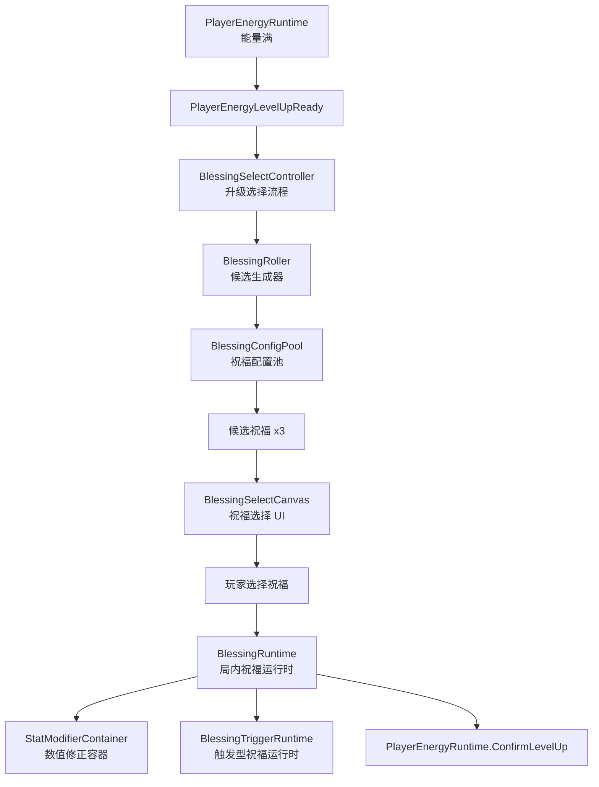
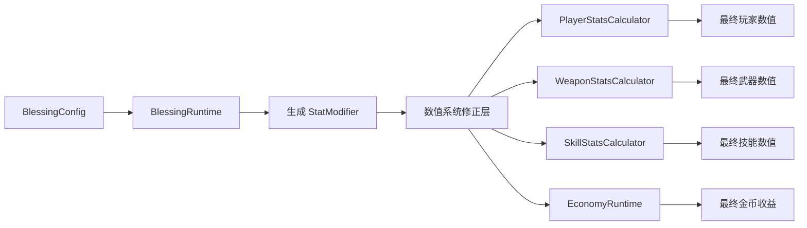
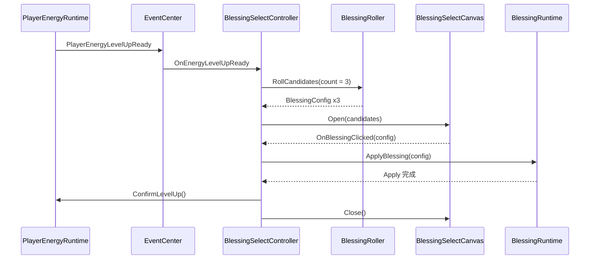
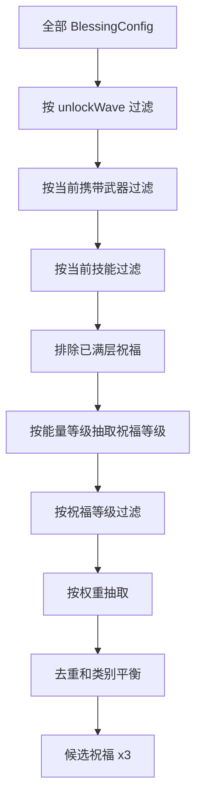
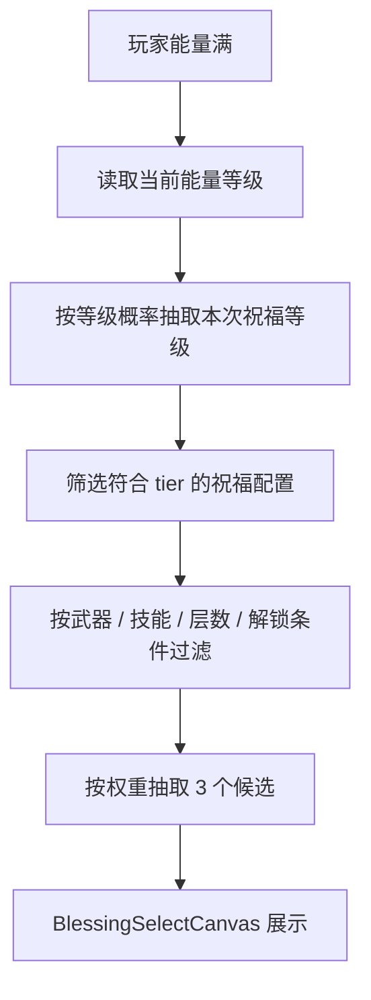
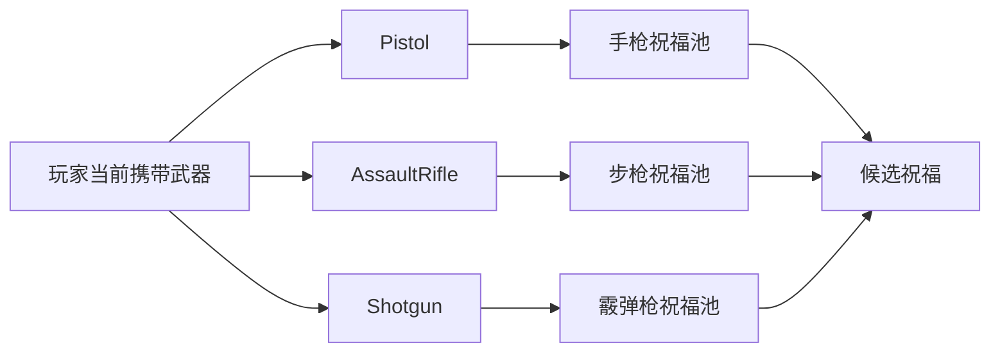
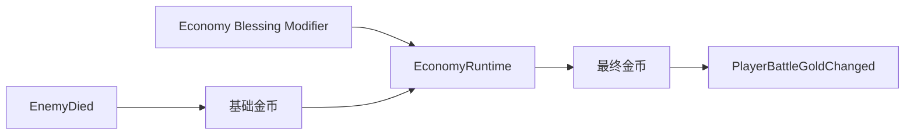
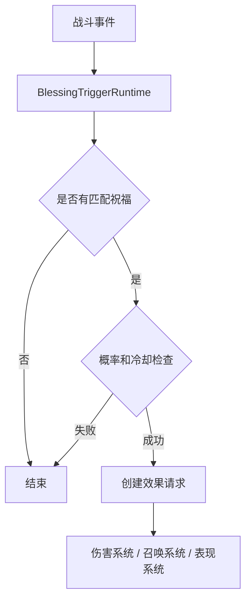
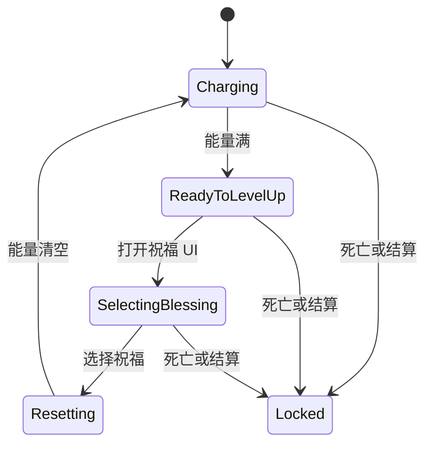

# FPSDemo 祝福系统架构设计

更新时间：2026-07-13

## 目标

祝福系统是局内肉鸽成长的核心。它不直接修改玩家、武器、技能配置，而是反复复用数值系统，向数值修正层写入可叠加、可查询、可清理的运行时修正。

核心目标：

- 每次升级时生成 3 个候选祝福
- 玩家选择 1 个祝福后立即影响当前局
- 祝福只在当前局生效，局外不保存
- 祝福效果优先通过数值系统生效
- 玩法触发型祝福通过事件驱动生效
- 支持叠层、权重、稀有度、波次解锁和武器过滤
- 后续可以快速新增大量祝福，不需要改武器、技能、玩家主逻辑

## 总体架构图



## 与数值系统关系

祝福系统本身不计算最终数值，它只生产修正。



规则：

- 祝福只调用数值系统公开接口添加或移除修正
- 祝福不直接改 `WeaponConfig / PlayerSkillConfig / PlayerBaseConfig`
- 祝福不直接改 UI 数字
- 祝福不直接操作场景对象
- 最终数值由各自 Calculator 统一合成

## 祝福分类

```csharp
public enum BlessingCategory
{
    PlayerStat,
    WeaponStat,
    SkillStat,
    GameplayTrigger,
    Economy
}
```

| 分类 | 作用 | 走数值系统方式 |
| --- | --- | --- |
| `PlayerStat` | 修改玩家自身属性 | 写入玩家数值修正 |
| `WeaponStat` | 修改武器属性 | 写入指定武器或全部武器修正 |
| `SkillStat` | 修改技能属性 | 写入指定技能修正 |
| `GameplayTrigger` | 监听事件触发额外玩法 | 写入触发器运行时，不直接改基础值 |
| `Economy` | 修改金币和奖励获取 | 写入金币修正 |

## 祝福目标

```csharp
public enum BlessingTargetType
{
    Player,
    CurrentWeapon,
    SpecificWeapon,
    AllWeapons,
    Skill,
    GameplayTrigger,
    Economy
}
```

目标解释：

- `Player`：玩家移动、生命、防御、能量倍率
- `CurrentWeapon`：选择祝福时当前武器
- `SpecificWeapon`：指定武器类型或 weaponId
- `AllWeapons`：所有当前携带武器
- `Skill`：Dodge / Push / Grenade
- `GameplayTrigger`：命中、击杀、开枪、闪避等事件
- `Economy`：金币倍率、掉落奖励、结算奖励

## 祝福配置结构

建议数据层创建：

```csharp
public class BlessingConfig
{
    public int blessingId;
    public string blessingName;
    public string description;
    public BlessingCategory category;
    public BlessingRarity rarity;
    public BlessingTier tier;
    public int maxStack;
    public int unlockWave;
    public int unlockEnergyLevel;
    public float weight;
    public int requiredWeaponId;
    public SkillType requiredSkillType;
    public List<BlessingEffectConfig> effects;
    public List<BlessingTriggerConfig> triggers;
}
```

资源层：

```csharp
public class BlessingConfigAsset : ScriptableObject
{
    public BlessingConfig config;
}
```

配置池：

```text
Assets/Resources/BlessingConfigs
```

## 祝福效果结构

普通数值型祝福使用统一效果结构。

```csharp
public class BlessingEffectConfig
{
    public BlessingTargetType targetType;
    public BlessingStatType statType;
    public BlessingModifyType modifyType;
    public float value;
}
```

修正方式：

```csharp
public enum BlessingModifyType
{
    Add,
    PercentAdd,
    Multiply,
    Override
}
```

最终值推荐仍按数值系统统一公式：

```text
最终值 = (基础值 + 固定加值) * (1 + 百分比加值) * 乘法倍率
```

## 祝福运行时数据

祝福运行时只记录当前局状态。

```csharp
public class BlessingRuntimeData
{
    public int blessingId;
    public int stackCount;
    public BlessingCategory category;
    public float cooldownTimer;
}
```

运行时容器：

```csharp
public class BlessingRuntime
{
    Dictionary<int, BlessingRuntimeData> activeBlessings;
    StatModifierContainer modifiers;
}
```

职责：

- 保存已选择祝福
- 处理叠层
- 判断是否达到最大层数
- 把祝福效果转换成数值修正
- 把触发型祝福注册到 `BlessingTriggerRuntime`
- 当前局结束时清空所有祝福和修正

## 祝福选择流程



`BlessingSelectController` 负责流程，不负责具体 UI 布局，也不负责最终数值计算。

## 候选生成规则

候选生成器 `BlessingRoller` 的过滤顺序：



过滤规则：

- 当前波次小于 `unlockWave` 的祝福不出现
- 当前能量等级小于 `unlockEnergyLevel` 的祝福不出现
- 武器祝福必须匹配玩家当前携带武器
- 技能祝福必须匹配玩家当前拥有技能
- 已达到 `maxStack` 的祝福不再出现
- 同一次三选一不重复出现同一个 `blessingId`
- 优先保证候选类型有差异，避免三个全是金币或三个全是同一把武器

## 祝福等级设计

祝福需要分等级，但等级只决定本次祝福的数值强度，不直接代表能量等级。

第一版推荐三档：

```csharp
public enum BlessingTier
{
    Normal,
    Plus,
    PlusPlus
}
```

显示规则：

| 等级 | UI 显示 | 定位 |
| --- | --- | --- |
| `Normal` | 无后缀 | 前期主力，稳定成长 |
| `Plus` | `+` | 中期开始出现，数值更高 |
| `PlusPlus` | `++` | 后期少量出现，提供爽感爆点 |

能量等级只影响高等级祝福出现概率，不直接改变祝福效果。

| 能量等级 | Normal | Plus | PlusPlus |
| --- | ---: | ---: | ---: |
| Lv1 | 100% | 0% | 0% |
| Lv2 | 80% | 20% | 0% |
| Lv3 | 65% | 30% | 5% |
| Lv4 | 50% | 40% | 10% |
| Lv5+ | 40% | 45% | 15% |

生成流程：



设计规则：

- `Normal / Plus / PlusPlus` 是同一个祝福的强度版本，可以共用逻辑
- `blessingId` 建议表示基础祝福，`tier` 表示这次抽到的强度
- 叠层按基础祝福计算，不按等级分开计算
- 例如步枪伤害强化已经 2 层，再拿到 `++` 后变为 3 层，但第三层使用 `++` 的数值
- 已达到 `maxStack` 的基础祝福不再出现，即使还有更高等级版本也不出现
- 第一版只让等级影响数值，不先做不同等级的复杂特效

数值倍率建议：

| 祝福类型 | Normal | Plus | PlusPlus |
| --- | ---: | ---: | ---: |
| 伤害百分比 | +10% | +18% | +30% |
| 射速百分比 | +6% | +10% | +16% |
| 换弹速度 | +8% | +14% | +22% |
| 技能冷却降低 | -6% | -10% | -16% |
| 金币获取 | +12% | +20% | +35% |
| 能量获取 | +10% | +18% | +30% |

后续如果要进一步做稀有度，可以让稀有度负责“机制复杂度”，祝福等级负责“数值强度”。

示例：

| 基础祝福 | Normal | Plus | PlusPlus |
| --- | --- | --- | --- |
| 步枪伤害强化 | 步枪伤害 +10% | 步枪伤害 +18% | 步枪伤害 +30% |
| 霰弹枪近距爆发 | 近距离伤害 +12% | 近距离伤害 +22% | 近距离伤害 +36% |
| 战斗兴奋 | 能量获取 +10% | 能量获取 +18% | 能量获取 +30% |
| 手雷扩容 | 手雷上限 +1 | 手雷上限 +1 且冷却 -6% | 手雷上限 +2 |

性能规则：

- 候选生成只在升级时执行，不每帧执行
- 概率表可以缓存为配置，不要运行时频繁创建临时列表
- 三选一生成结果要去重，避免同一基础祝福不同等级同时出现
- 触发型 `PlusPlus` 祝福必须继续遵守概率、冷却和同屏上限

## 武器祝福生成规则

武器祝福是最容易失控的部分，必须和当前携带武器绑定。



示例：

| 武器 | 可生成祝福 |
| --- | --- |
| 手枪 | 手枪伤害、手枪暴击、手枪射速、手枪换弹 |
| 步枪 | 步枪伤害、步枪弹夹、步枪后坐力、步枪射速 |
| 霰弹枪 | 弹丸数量、散射降低、近距离增伤、逐发装填加速 |
| 全武器 | 全武器伤害、全武器暴击、全武器换弹速度 |

## 技能祝福生成规则

技能祝福根据玩家当前拥有技能生成。

| 技能 | 可生成祝福 |
| --- | --- |
| Dodge | CD 降低、距离增加、无敌时间增加、闪避后强化开火 |
| Push | 范围增加、击退增加、伤害增加、眩晕时间增加 |
| Grenade | 最大数量增加、爆炸范围增加、伤害增加、冷却降低 |

技能祝福不直接改 `PlayerSkillConfig`，只写入技能数值修正。

## 玩家数值型祝福

玩家数值型祝福进入玩家修正层。

示例：

| 祝福 | 效果 |
| --- | --- |
| 强壮体魄 | 最大生命 +20 |
| 灵活步伐 | 移动速度 +8% |
| 战斗兴奋 | 能量获取 +15% |
| 坚韧皮肤 | 受到伤害 -10% |
| 危急恢复 | 低血量击杀回血 |

数据流：


## 金币获取型祝福

金币祝福进入经济修正层。

示例：

| 祝福 | 效果 |
| --- | --- |
| 贪婪 | 金币获取 +20% |
| 精英悬赏 | 精英怪金币 +50% |
| 连杀奖励 | 连杀时金币倍率提高 |
| 波次赏金 | 每波结束额外金币 |

数据流：



## 玩法触发型祝福

玩法触发型祝福不只是数值修正，它会监听战斗事件。

```csharp
public enum BlessingTriggerType
{
    OnFire,
    OnHitEnemy,
    OnCriticalHit,
    OnKillEnemy,
    OnReload,
    OnDodge,
    OnSkillCast,
    OnPlayerDamaged,
    OnWaveStart
}
```

触发配置：

```csharp
public class BlessingTriggerConfig
{
    public BlessingTriggerType triggerType;
    public float chance;
    public float cooldown;
    public string effectKey;
    public float damageMultiplier;
    public float radius;
    public int chainCount;
    public int maxActiveCount;
}
```

数据流：



示例：

| 祝福 | 触发 | 效果 |
| --- | --- | --- |
| 电弧弹药 | 命中敌人 | 8% 概率生成闪电链 |
| 爆裂弹头 | 暴击 | 小范围爆炸 |
| 死亡召唤 | 击杀敌人 | 概率生成召唤物 |
| 闪避装填 | 闪避后 | 下一次开火伤害提高 |
| 雷爆手雷 | 手雷爆炸 | 留下持续伤害区域 |

## 触发型祝福性能规则

- 只在事件发生时判断，不每帧遍历
- 高频事件必须有概率
- 高频事件必须有冷却
- 召唤物和特效必须走对象池
- 同屏效果必须有上限
- 高射速武器触发特效必须节流
- 触发伤害必须走统一伤害流程，避免绕过敌人受击和能量系统

## BlessingSelectController 职责

`BlessingSelectController` 是升级选择流程控制器。

负责：

- 监听 `PlayerEnergyLevelUpReady`
- 通知能量系统进入 `SelectingBlessing`
- 调用 `BlessingRoller` 生成候选祝福
- 打开 `BlessingSelectCanvas`
- 把候选祝福传给 UI
- 接收玩家选择
- 调用 `BlessingRuntime.ApplyBlessing`
- 调用 `PlayerEnergyRuntime.ConfirmLevelUp`
- 关闭 UI
- 恢复战斗

不负责：

- 计算最终数值
- 保存祝福层数
- 直接修改玩家、武器、技能配置
- 播放具体特效

## BlessingSelectCanvas 职责

`BlessingSelectCanvas` 是纯表现 UI。

负责：

- 显示 3 个祝福卡片
- 显示祝福名称、描述、稀有度、图标
- 显示当前层数和最大层数
- 点击卡片后回调选择结果

不负责：

- 生成候选祝福
- 应用祝福
- 清空能量
- 修改数值

## BlessingRuntime 职责

`BlessingRuntime` 是当前局祝福运行时。

负责：

- 保存已选祝福
- 保存每个祝福当前层数
- 处理叠层
- 判断祝福是否满层
- 把普通祝福转换成数值修正
- 把触发型祝福注册到 `BlessingTriggerRuntime`
- 当前局结束时清空所有祝福

## 与能量状态机对接

祝福系统依赖能量系统状态。

建议能量状态：

```csharp
public enum PlayerEnergyState
{
    Charging,
    ReadyToLevelUp,
    SelectingBlessing,
    Resetting,
    Locked
}
```

状态流：



规则：

- `Charging` 可以获取能量
- `ReadyToLevelUp` 停止继续获取能量
- `SelectingBlessing` 等待玩家选择
- `Resetting` 播放能量清空表现
- `Locked` 用于死亡、结算、切场景

## 第一版祝福池建议

先做容易验证的数值型祝福，不急着做复杂召唤和闪电链。

| 祝福 | 分类 | 效果 |
| --- | --- | --- |
| 生命强化 | PlayerStat | 最大生命 +20 |
| 疾跑本能 | PlayerStat | 移动速度 +8% |
| 战斗兴奋 | PlayerStat | 能量获取 +15% |
| 枪械专注 | WeaponStat | 当前武器伤害 +12% |
| 扩容弹匣 | WeaponStat | 当前武器弹夹 +20% |
| 稳定握持 | WeaponStat | 当前武器后坐力 -15% |
| 快速冷却 | SkillStat | 所有技能 CD -10% |
| 爆破储备 | SkillStat | 手雷最大数量 +1 |
| 贪婪本能 | Economy | 金币获取 +20% |

第二版再做：

- 闪电链
- 暴击爆炸
- 击杀召唤物
- 闪避后强化开火
- 手雷元素区域

## 数据层任务

数据层需要准备：

- `BlessingCategory`
- `BlessingTargetType`
- `BlessingModifyType`
- `BlessingStatType`
- `BlessingTriggerType`
- `BlessingRarity`
- `BlessingConfig`
- `BlessingEffectConfig`
- `BlessingTriggerConfig`
- `BlessingConfigAsset`
- 默认祝福配置资源
- `Docs/Data_Quick_Reference.md` 祝福快速表

## 表现与控制层任务

表现与控制层需要准备：

- `BlessingRuntime`
- `BlessingRoller`
- `BlessingSelectController`
- `BlessingSelectCanvas`
- `BlessingTriggerRuntime`
- 数值系统修正容器接入
- 玩家、武器、技能读取最终数值
- 玩法触发型祝福的对象池和表现资源接入

## 当前边界结论

- 能量系统发起升级准备事件
- 祝福选择控制器打开 UI
- UI 只显示和回传选择
- 祝福运行时保存和应用祝福
- 数值系统负责最终属性计算
- 战斗系统只读取最终数值
- 表现系统只监听结果事件
