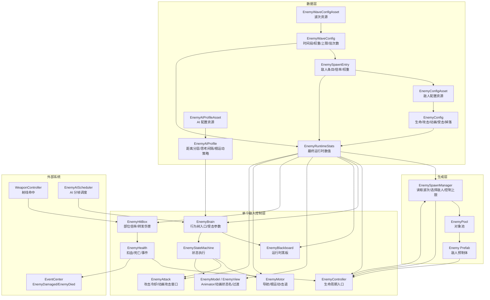
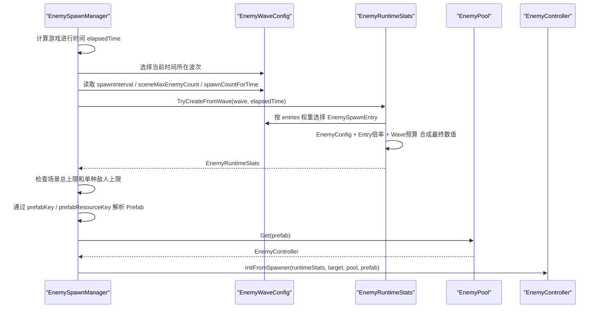
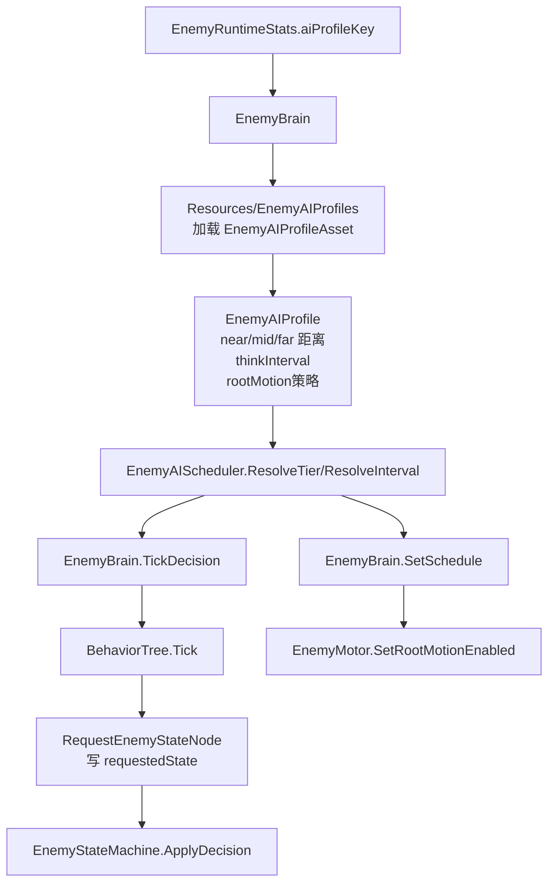
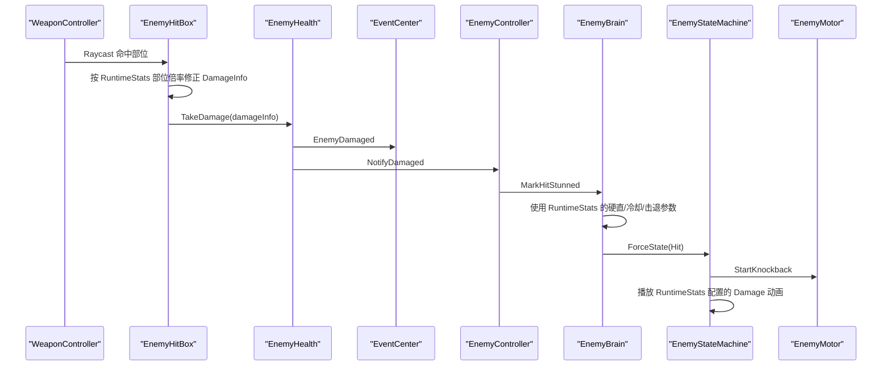

# 敌人系统架构图与数据流图

## 1. 当前接入状态

敌人数据层已经接入运行链路。当前运行时优先使用 `EnemyWaveConfig` 生成 `EnemyRuntimeStats`，再把最终数值注入到敌人控制层、AI 层、表现层和命中部位层。

当前已接入：

- 波次数据：`EnemyWaveConfigAsset`
- 敌人基础数据：`EnemyConfigAsset`
- 波次条目：`EnemySpawnEntry`
- 最终运行时数据：`EnemyRuntimeStats`
- AI 性能配置：`EnemyAIProfileAsset`
- 刷怪入口：`EnemySpawnManager`
- 单个敌人入口：`EnemyController`
- 黑板数据：`EnemyBlackboard`
- 行为树 Key：`EnemyBrain`
- AI 距离分层和思考间隔：`EnemyAIScheduler`
- 动画状态名和过渡时间：`EnemyModel / EnemyView`
- 部位伤害倍率：`EnemyHitBox`
- 受击硬直、受击冷却、击退参数：`EnemyBrain`

当前仍保留的兜底：

- 如果数据层 PrefabKey 找不到 Prefab，会用场景旧 `spawnDefinitions` 中的 Prefab 兜底
- 当前只有低模骷髅僵尸 Prefab 已完整接入，Fast / Elite 可以先复用骨架 Prefab 测数值，后续再补真实 Prefab

## 2. 总架构图

## 3. 波次生成数据流

## 4. 单个敌人初始化数据流

```mermaid
flowchart LR
    Runtime["EnemyRuntimeStats"] --> Controller["EnemyController.InitFromSpawner"]
    Controller --> Health["EnemyHealth.Init\nmaxHealth"]
    Controller --> Model["EnemyModel.ApplyRuntimeStats\n动画名/过渡时间"]
    Controller --> HitBox["EnemyHitBox.ApplyRuntimeStats\n头/身体/手/腿倍率"]
    Controller --> Motor["EnemyMotor.Init\n速度/转向/加速度/停止距离"]
    Controller --> Attack["EnemyAttack.Init\n攻击伤害/距离/间隔/打击延迟"]
    Controller --> Brain["EnemyBrain.Init\n行为树Key/受击参数/AIProfileKey"]
    Brain --> Blackboard["EnemyBlackboard.Init\n感知距离/攻击距离/运行时上下文"]
    Brain --> StateMachine["EnemyStateMachine.Init\nIdle/Chase/Attack/Hit/Dead"]
```

## 5. AI 调度数据流

说明：

- 近处敌人可以更高频思考
- 中远距离敌人降低行为树更新频率
- 根运动是否启用由 `EnemyAIProfile` 决定
- 行为树仍然只写黑板，不直接移动、不直接播动画

## 6. 武器命中与受击数据流

Debug 保留：

- `[WeaponHit]`：武器射线命中
- `[EnemyHitBox]`：命中部位和倍率
- `[EnemyDamage]`：扣血结果
- `[EnemyHitState]`：完整受击或轻受击
- `[EnemyAnim]`：动画播放路径或缺失状态

## 7. 当前代码接入点

| 数据字段 | 当前消费位置 |
| --- | --- |
| `EnemyWaveConfig.spawnInterval` | `EnemySpawnManager.ResolveSpawnInterval` |
| `EnemyWaveConfig.spawnCountPerBatch` | `EnemySpawnManager.ResolveSpawnCount` |
| `EnemyWaveConfig.sceneMaxEnemyCount` | `EnemySpawnManager.ResolveSceneMaxEnemyCount` |
| `EnemySpawnEntry.weight` | `EnemyRuntimeStats.TryCreateFromWave` |
| `EnemySpawnEntry.maxAliveCount` | `EnemySpawnManager.CanSpawnRuntimeStats` |
| `EnemyConfig.prefabKey / prefabResourceKey` | `EnemySpawnManager.ResolvePrefab` |
| `EnemyConfig.behaviorTreeKey` | `EnemyBrain.Init` |
| `EnemyConfig.aiProfileKey` | `EnemyBrain.ResolveAIProfile` |
| `EnemyConfig.maxHealth` | `EnemyHealth.Init` |
| `EnemyConfig.moveSpeed / angularSpeed / acceleration` | `EnemyMotor.Init` |
| `EnemyConfig.attackDamage / attackDistance / attackInterval / attackHitDelay` | `EnemyAttack.Init` |
| `EnemyConfig.detectionRange` | `EnemyBlackboard.Init` |
| `EnemyConfig.hitStunDuration / hitReactionCooldown / hitKnockbackDistance / hitKnockbackDuration` | `EnemyBrain.MarkHitStunned` |
| `EnemyConfig.idle/walk/run/attack/damage/deathStateName` | `EnemyModel.ApplyRuntimeStats` |
| `EnemyConfig.locomotion/attack/hit/death/recoverTransition` | `EnemyModel.ApplyRuntimeStats` |
| `EnemyConfig.head/body/arm/legDamageMultiplier` | `EnemyHitBox.ApplyRuntimeStats` |
| `EnemyAIProfile.near/mid/farDistance` | `EnemyAIScheduler.ResolveTier` |
| `EnemyAIProfile.near/mid/far/sleepThinkInterval` | `EnemyAIScheduler.ResolveInterval` |
| `EnemyAIProfile.useRootMotionNear/useRootMotionMid` | `EnemyBrain.SetSchedule -> EnemyMotor.SetRootMotionEnabled` |

## 8. 目前还未完成的关联

这些不是数据层缺失，而是后续控制层需要继续接：

- `EnemyAIProfile.enableAgentNear / enableAgentMid` 暂未切换 Agent 启停
- `EnemyAIProfile.animatorLodDistance` 暂未接 Animator LOD
- `EnemyAIProfile.attackPriority / surroundRadius` 暂未接攻击名额和包围系统
- `EnemyRuntimeStats.dropPoolKey` 暂未接掉落系统
- `EnemyRuntimeStats.blessingEnergyReward / experienceReward` 暂未接祝福能量和经验系统
- Fast / Elite 的真实 Prefab 还没制作，当前会走 Prefab 兜底或需要手动绑定 Prefab

## 9. 后续推进顺序

1. 制作 Fast / Elite 对应 Prefab，补到 `EnemySpawnManager.prefabBindings`
2. 接攻击名额系统，使用 `maxAttackersCount / attackPriority / surroundRadius`
3. 接掉落系统，使用 `dropPoolKey / goldReward`
4. 接祝福能量，使用 `blessingEnergyReward / experienceReward`
5. 接 AI 降级策略，使用 `enableAgentNear / enableAgentMid / animatorLodDistance`
6. 把 PrefabKey 解析从临时绑定升级为正式资源注册表
