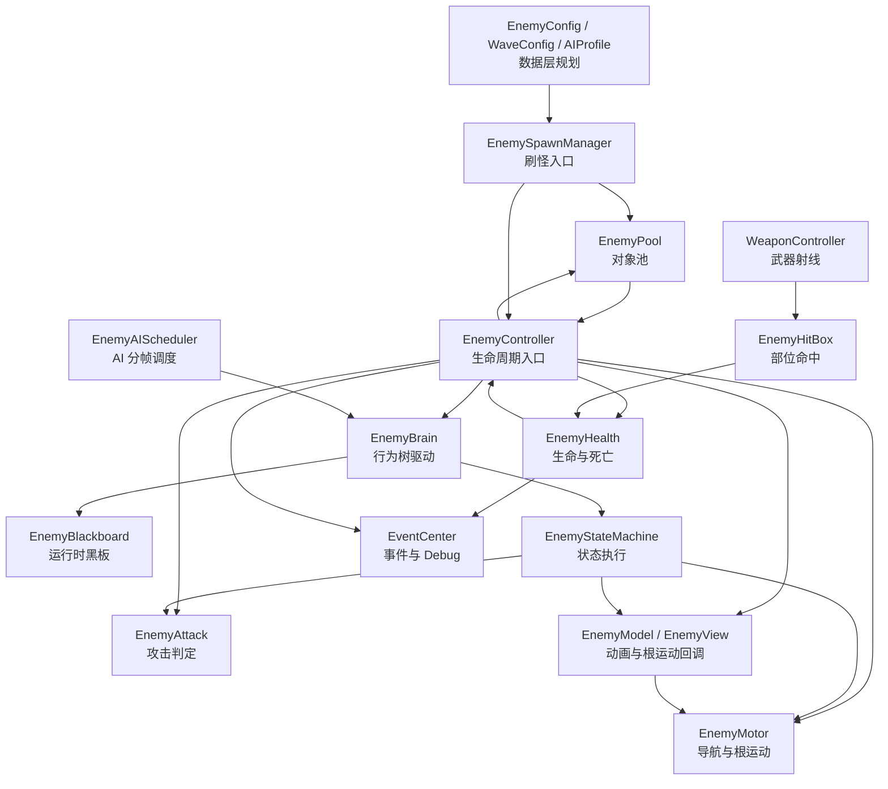
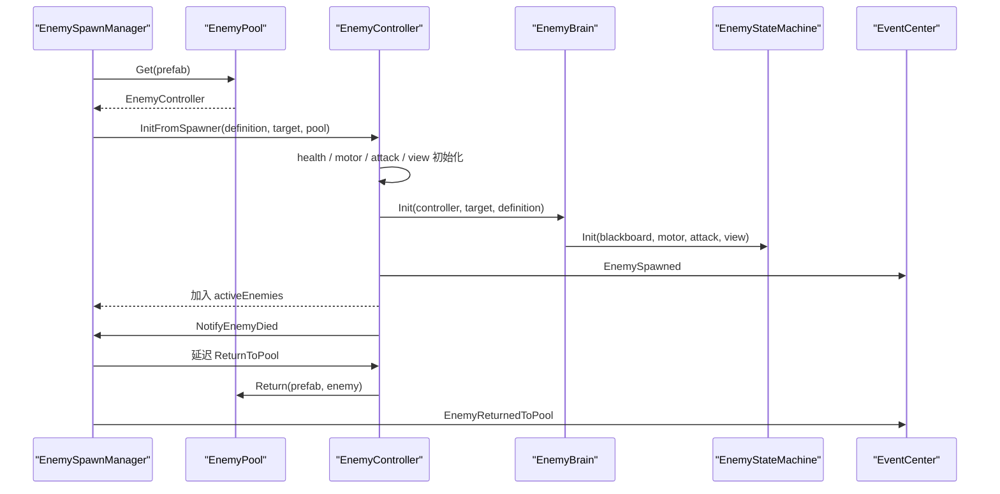
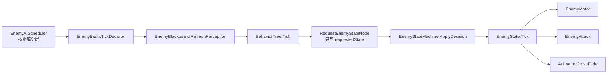
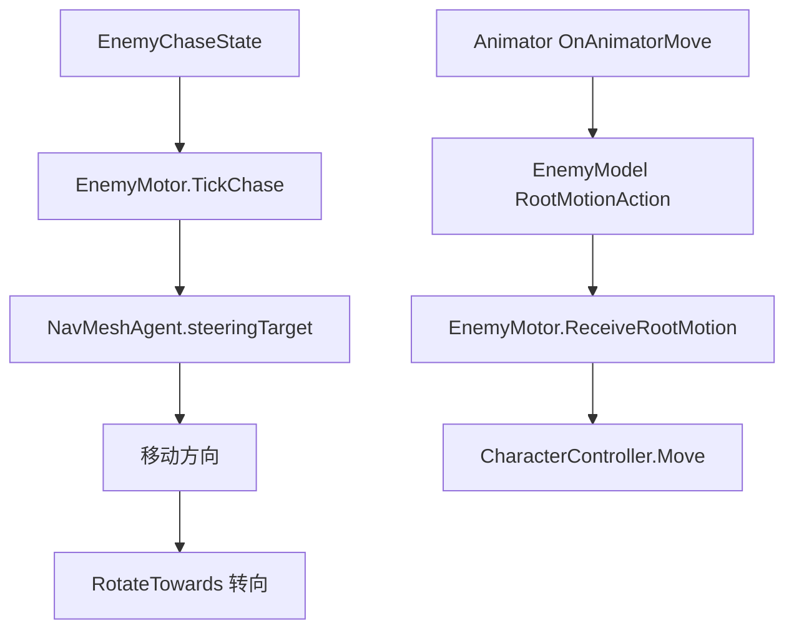
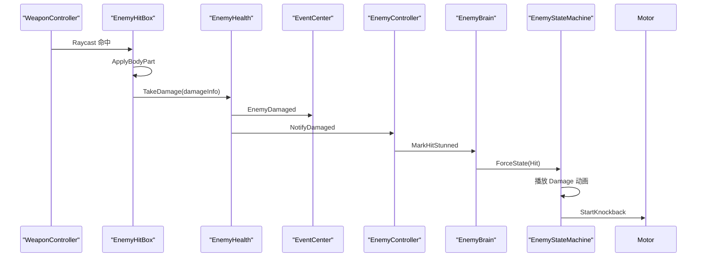

# 敌人系统架构与数据流

本文档用于统一敌人系统的控制层、表现层和数据层协作边界。后续完善敌人、波次、掉落、氛围感表现时，先按本文档确认职责归属，再动代码。

## 1. 当前目标

敌人系统要服务大量怪物同屏的肉鸽 FPS 场景。当前第一阶段目标不是做复杂怪物，而是保证普通近战僵尸这条链路稳定：

```text
刷怪 -> 追玩家 -> 攻击 -> 被武器命中 -> 受伤/死亡 -> 回池 -> 下一批复用
```

核心原则：

- 行为树只做决策，不直接移动、不直接播动画、不直接扣血
- 状态机只做执行，不负责刷怪池和数据表读取
- NavMeshAgent 只提供路径方向，最终位移走 CharacterController
- 根运动负责移动质感，导航负责转向和路径
- 武器命中先经过 EnemyHitBox，再交给 EnemyHealth 结算
- 临时画面表现先清理掉，后续统一接氛围感系统
- Debug 日志和事件保留，便于继续测试

## 2. 总架构图



## 3. 模块职责

| 模块 | 当前职责 | 不应该做的事 |
| --- | --- | --- |
| `EnemySpawnManager` | 生成敌人、控制场景上限、死亡后延迟回池 | 不写敌人 AI，不直接改动画 |
| `EnemyPool` | 按 Prefab 复用敌人对象 | 不决定波次和敌人数值 |
| `EnemyController` | 统一初始化组件、接收受伤死亡通知、关闭碰撞、回池 | 不直接写追击、攻击、动画细节 |
| `EnemyBrain` | 刷新感知、执行行为树、把状态请求交给状态机 | 不直接 Move，不直接 CrossFade |
| `EnemyBlackboard` | 保存行为树需要的运行时上下文 | 不访问场景查找对象 |
| `EnemyStateMachine` | 切状态、播动画、推进状态 Tick、绑定根运动 | 不读取配置表，不管理对象池 |
| `EnemyMotor` | 用 NavMeshAgent 求方向，用 CharacterController 位移 | 不决定攻击，不结算伤害 |
| `EnemyAttack` | 攻击冷却、AtkS/AtkE 命中窗口、玩家伤害 | 不决定追击状态 |
| `EnemyHealth` | 扣血、死亡判断、伤害事件、Debug | 不做红闪等画面表现 |
| `EnemyHitBox` | 部位倍率、暴击部位、转交伤害 | 不决定敌人死亡 |
| `EnemyModel / EnemyView` | Animator、状态名、过渡时间、根运动回调 | 不读敌人数值数据 |

## 4. 生成与回池数据流



当前 `EnemySpawnDefinition` 还是场景里的临时结构。后续数据层要把它替换成 `EnemyRuntimeStats`，由 `EnemyConfig + EnemySpawnEntry + EnemyWaveConfig` 计算得到。

## 5. AI 决策与执行流



行为优先级：

```text
Dead > Hit > Attack > Chase > Idle
```

当前行为树由 `EnemyBrainFactory.BuildZombieMeleeTree` 临时代码生成。后续导入正式行为树工具后，也必须保持同样的边界：行为树只读写黑板，不直接操作组件。

## 6. 移动与动画流



当前移动设计：

- `NavMeshAgent.updatePosition = false`
- `NavMeshAgent.updateRotation = false`
- Agent 只提供 `steeringTarget` 或 `desiredVelocity`
- 角色最终通过 `CharacterController.Move`
- 近距离可用根运动，远距离后续可降级为简化位移

## 7. 伤害与受击流



保留 Debug：

- `[WeaponHit]` 武器命中
- `[EnemyHitBox]` 部位命中和倍率
- `[EnemyDamage]` 扣血结果
- `[EnemyHitState]` 完整受击或轻受击
- `[EnemyAnim]` 动画播放或状态缺失

已清理临时画面表现：

- 删除敌人命中材质闪红
- 删除玩家受伤红屏
- 保留 `EnemyDamaged` 和 `PlayerDamaged` 事件，后续氛围感系统统一监听

## 8. 当前代码整理结论

保留：

- `EnemyController`
- `EnemySpawnManager`
- `EnemyPool`
- `EnemyBrain`
- `EnemyBlackboard`
- `EnemyBrainFactory`
- `EnemyAIScheduler`
- `EnemyBehaviorNodes`
- `EnemyStateMachine`
- `EnemyMotor`
- `EnemyAttack`
- `EnemyHealth`
- `EnemyHitBox`
- `EnemyAnimationEventReceiver`
- `EnemyModel`
- `EnemyView`

已清理：

- `EnemyHitFeedback`
- `PlayerDamageFeedback`
- `EnemyModel.actionTransition`

暂时不清理：

- `EnemyView.PlayIdle / PlayMove / PlayAttack / PlayDamage / PlayDeath`
- 原因是它们仍可作为兼容接口，之后如果状态机完全稳定，可以再删

## 9. 后续完善顺序

1. 数据层接入
   - 用 `EnemyRuntimeStats` 替换 `EnemySpawnDefinition`
   - 让 `EnemySpawnManager` 从波次数据选择敌人
   - 统一 PrefabKey 到实际 Prefab 的解析方式

2. AI Profile 接入
   - `EnemyAIScheduler` 读取 AIProfile 的距离和思考间隔
   - `EnemyMotor` 根据距离层级决定根运动、Agent、Animator 降级策略

3. 攻击名额系统
   - 限制同一时间可攻击玩家的敌人数
   - 近处敌人排队攻击，远处敌人围绕或挤压
   - 数据层提供 `attackPriority` 和 `surroundRadius`

4. 正式氛围感系统
   - 监听 `EnemyDamaged`、`EnemyDied`、`PlayerDamaged`
   - 统一处理屏幕边缘血色、命中火花、击杀提示、音效、震动
   - 不再把画面表现塞回 Health 或 Attack

5. 掉落和收益
   - `EnemyDied` 事件驱动金币、道具、祝福能量
   - 掉落物走对象池
   - 数据层配置掉落池和权重

6. 多敌人类型
   - 普通近战
   - 快速近战
   - 精英近战
   - 远程敌人
   - 特殊自爆或控制敌人

## 10. 给数据层的任务

数据层下一步优先做这些，不要先改表现层：

1. 统一敌人 Key
   - `EnemyConfig.behaviorTreeKey` 当前默认是 `MeleeZombie`
   - 控制层当前行为树 Key 是 `ZombieMelee`
   - 需要统一成一个，建议统一为 `ZombieMelee`

2. 完善 `EnemyRuntimeStats`
   - 增加 `hitStunDuration`
   - 增加 `hitReactionCooldown`
   - 增加 `hitKnockbackDistance`
   - 增加 `hitKnockbackDuration`
   - 增加 `attackTransition`
   - 增加 `hitTransition`
   - 增加 `deathTransition`
   - 增加 `recoverTransition`

3. 完善 `EnemyConfig`
   - 增加动画状态名配置
   - 增加 Prefab 资源 Key
   - 增加碰撞盒部位配置或使用默认部位模板 Key
   - 增加掉落池 Key
   - 增加基础经验或祝福能量奖励

4. 完善 `EnemyWaveConfig`
   - 支持按游戏时间切换波次
   - 支持每波不同敌人权重
   - 支持每种敌人的同时存活上限
   - 支持场景总怪物上限
   - 支持每批生成数量随时间成长

5. 完善 `EnemyAIProfile`
   - 距离分层数据接入 `EnemyAIScheduler`
   - 根运动开关接入 `EnemyMotor`
   - Animator LOD 距离后续接表现层
   - 攻击优先级和包围半径预留给攻击名额系统

6. 提供运行时构建入口
   - 输入 `EnemyWaveConfig + 当前游戏时间`
   - 输出可生成的 `EnemyRuntimeStats`
   - 控制层只消费 RuntimeStats，不直接读 ScriptableObject

## 11. 控制层近期任务

1. 给 `EnemySpawnManager` 做 RuntimeStats 适配层
2. 让 `EnemyBrain` 的行为树 Key 来自 RuntimeStats
3. 让 `EnemyBlackboard.detectionRange` 来自 RuntimeStats
4. 把受击参数从 `EnemyBrain` Inspector 临时字段迁移到 RuntimeStats
5. 做攻击名额管理器，避免大量敌人同时攻击
6. 做最小氛围感系统接口，只监听事件，不改 Health

## 12. 调试清单

编辑器中测试敌人时优先看这些日志：

```text
[WeaponHit] 是否射线打到敌人
[EnemyHitBox] 是否命中正确部位
[EnemyDamage] 是否扣血
[EnemyHitState] 是否进入完整受击或轻受击
[EnemyAnim] 是否播放到正确动画状态
```

如果没有任何受击效果：

1. 先看 `[WeaponHit]`
2. 再看 `[EnemyHitBox]`
3. 再看 `[EnemyDamage]`
4. 最后看 `[EnemyAnim]`

不要先改动画，先确认数据流有没有走通。
