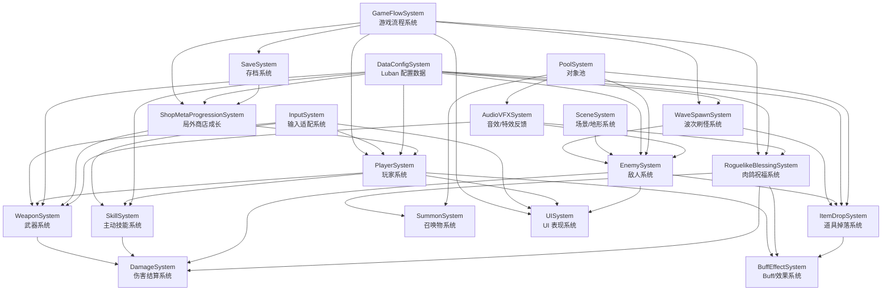
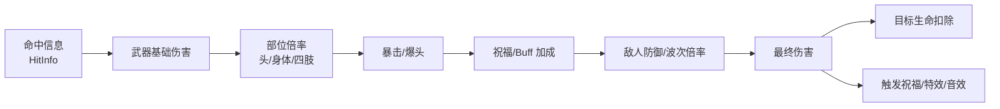
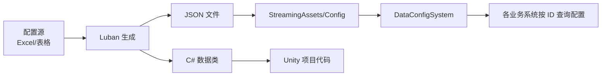
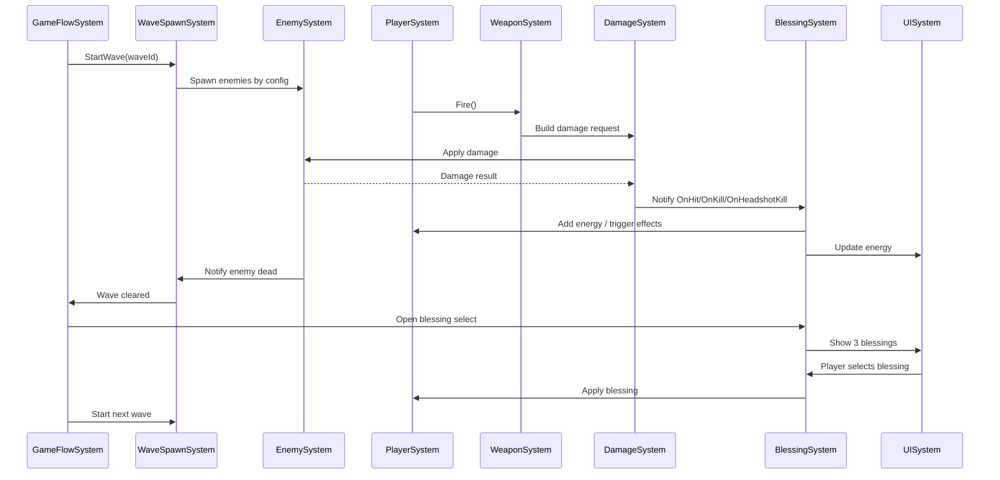
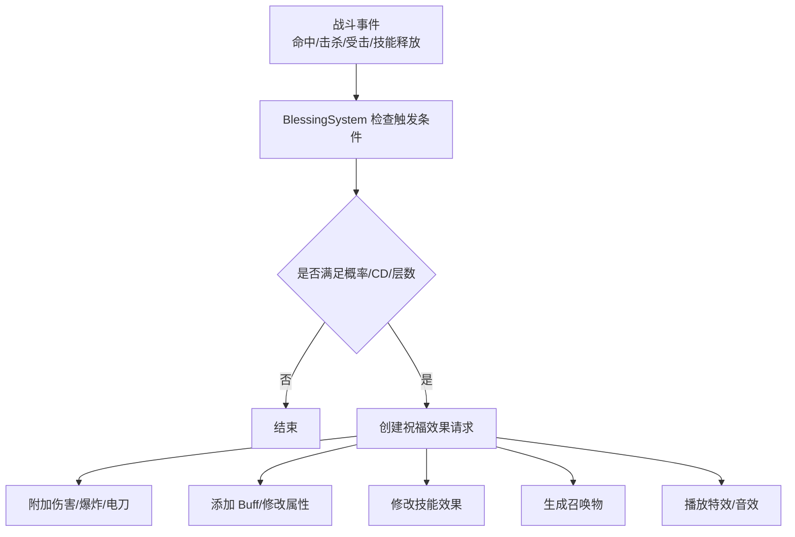
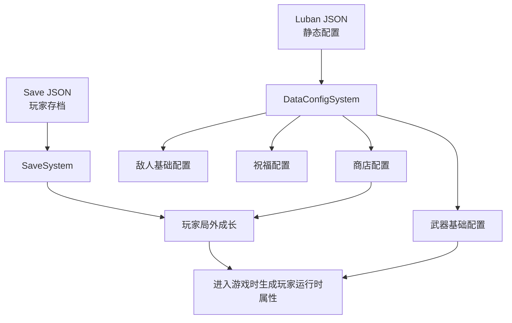

# FPS 丧尸生存肉鸽项目架构文档

## 1. 项目目标

本项目目标是在 7 天内完成一个可运行、可演示、可打包 APK 的单机 3D FPS 丧尸生存肉鸽原型。

核心体验闭环：

```text
开始游戏 -> 玩家移动/射击 -> 丧尸刷怪追击 -> 击杀获得能量/掉落 -> 选择祝福成长 -> 进入下一波 -> 胜利或死亡结算 -> 获得金币 -> 局外商店成长
```

本项目不做联机。联机是 PDF 加分项，但当前周期内优先保证单机体验完整、稳定、可展示。

## 2. 当前已有基础

项目中已经有部分可复用基础框架：

| 已有模块 | 当前代码 | 用途 |
| --- | --- | --- |
| 角色基础 | `CharacterBase` | CharacterController、重力、地面检测 |
| 状态机 | `StateMachine` / `StateBase` | 可用于敌人 AI 状态 |
| 输入系统 | `GameInputManger` / `InputAcyions` | 可改造成 FPS 输入 |
| UI 框架 | `UIManager` / `BasePanel` | UI 分层、面板打开关闭、缓存 |
| 对象池 | `PoolMgr` | 敌人、特效、音效对象复用 |
| 事件中心 | `EventCenter` | 系统之间解耦通知 |
| JSON 存档 | `JsonMgr` | 保存玩家局外数据 |
| 资源管理 | `ResMgr` / `ABManager` | 资源加载 |
| 音效管理 | `MusicMgr` | BGM、音效播放 |
| 特效管理 | `EffectMgr` | 特效播放与回收 |

需要注意：已有 UI 是基础框架，还需要补业务面板；已有 JsonMgr 更适合存档，Luban 配置应单独管理。

## 3. 总体架构图



## 4. 分层设计

```text
表现层
UI、音效、特效、屏幕震动、命中特效、武器附着特效

玩法层
玩家、武器、技能、敌人、波次、道具、祝福、召唤物、场景交互

规则层
伤害结算、Buff 效果、局内成长、敌人成长、结算金币

数据层
Luban 静态配置、运行时局内数据、Json 本地存档

基础层
对象池、事件中心、资源管理、输入、状态机、Mono 管理器
```

## 5. 核心系统拆分

### 5.1 GameFlowSystem 游戏流程系统

职责：

- 控制游戏状态切换
- 管理开始、战斗、祝福选择、暂停、胜利、失败、结算
- 驱动波次系统、UI 系统、存档系统

建议状态：

```text
MainMenu
Prepare
Fighting
BlessingSelect
Paused
Victory
Failed
Settlement
```

首周必须完成：

- 开始游戏
- 战斗中
- 祝福选择
- 失败结算
- 胜利结算

### 5.2 PlayerSystem 玩家系统

职责：

- FPS 移动
- 第一人称视角
- 生命值
- 受击/死亡
- 临时属性修改

子模块：

```text
PlayerController      移动、跳跃、闪避输入
PlayerCameraController 第一人称视角
PlayerHealth          生命、受击、死亡
PlayerRuntimeStats    局内临时属性
PlayerMetaStats       局外基础成长
```

局内属性：

- 当前生命
- 最大生命
- 移动速度
- 闪避距离
- 受到伤害倍率
- 是否霸体
- 是否无限子弹

首周建议：

- 移动、视角、生命、受击、死亡
- 闪避可以做，跳跃按场景需要决定

### 5.3 WeaponSystem 武器系统

职责：

- 管理玩家持有武器
- 射击、换弹、弹药
- 武器切换
- 武器表现
- 武器局内/局外升级

武器类型：

```text
Pistol      手枪，低射速，稳定
Rifle       步枪，高射速，消耗快
Shotgun     散弹枪，多射线，近距离爆发
```

武器属性：

- 武器 ID
- 伤害
- 射速
- 弹夹容量
- 当前弹夹子弹
- 最大备弹
- 换弹时间
- 散射角
- 射线数量
- 爆头倍率
- 特效挂点

武器附着特效处理方式：

```text
祝福/Buff 激活 -> BuffEffectSystem 通知 WeaponVisual -> 武器挂载闪电/火焰/印记等特效
```

不建议把“武器附着特效”单独做成复杂系统，首周作为 WeaponVisual 的扩展即可。

### 5.4 SkillSystem 主动技能系统

职责：

- 管理玩家主动技能
- CD 计时
- 技能释放
- 技能被祝福改造

技能建议：

```text
DodgeSkill      闪避
BombSkill       炸弹
PushSkill       推开敌人
```

首周建议：

- 必做：闪避或炸弹二选一
- 可选：推开敌人

技能通用结构：

```text
技能 ID
冷却时间
当前冷却
释放条件
释放效果
祝福修改器
```

示例祝福：

```text
闪避 -> 冲撞
冲撞命中敌人 -> 减少闪避 CD
炸弹 -> 胆汁
胆汁命中区域 -> 吸引敌人
```

### 5.5 ItemDropSystem 道具系统

职责：

- 场景生成掉落物
- 敌人死亡掉落
- 玩家拾取
- 转换为恢复、弹药或 Buff

道具类型：

```text
HealthPack      恢复生命
AmmoPack        增加子弹
Adrenaline      短时间加速
SuperArmor      短时间霸体
InfiniteAmmo    短时间无限子弹/不用换弹
BileBombChange  将炸弹临时改为胆汁
```

首周建议：

- 回血
- 子弹补给
- 肾上腺
- 无限子弹

胆汁变化是加分项，涉及敌人仇恨逻辑，后置。

### 5.6 RoguelikeBlessingSystem 肉鸽祝福系统

职责：

- 玩家击杀/命中获得能量
- 能量满 100 后暂停战斗并弹出祝福三选一
- 应用祝福
- 管理祝福触发条件和效果

祝福设计建议统一成：

```text
触发条件 Trigger + 效果 Effect + 数值参数 Params
```

祝福触发类型：

```text
OnHit           命中敌人
OnKill          击杀敌人
OnHeadshotKill  爆头击杀
OnSkillCast     释放技能
OnDodgeHit      闪避/冲撞命中
OnDamaged       玩家受击
Passive         常驻属性
Settlement      结算加成
```

祝福效果类型：

```text
ModifyStat          修改数值
AddElementDamage    附加元素伤害
ChainLightning      连锁闪电
AddMark             叠加印记
Explode             爆炸
ModifySkill         改造技能
Summon              召唤物
IncreaseGold        结算金币增加
```

首周建议祝福池：

```text
伤害 +20%
最大生命 +30
移动速度 +15%
射速 +15%
弹夹容量 +30%
爆头击杀爆炸
命中概率触发连锁闪电
攻击叠印记，满层爆炸
闪避 CD 降低
金币结算 +20%
```

### 5.7 BuffEffectSystem Buff/效果系统

职责：

- 管理所有临时效果
- 处理持续时间、层数、触发概率、冷却
- 给玩家、武器、敌人、召唤物添加效果

Buff 类型：

```text
StatBuff        数值变化
TimedBuff       限时效果
StackBuff       层数效果
TriggerBuff     触发型效果
VisualBuff      表现型效果
```

例子：

```text
肾上腺 -> TimedBuff 修改移动速度
电刀 -> TriggerBuff 命中概率触发 ChainLightning
印记 -> StackBuff 满层触发 Explode
无限子弹 -> TimedBuff 修改武器弹药消耗
```

### 5.8 DamageSystem 伤害结算系统

职责：

- 统一计算所有伤害
- 避免武器、祝福、技能、召唤物各算各的

伤害来源：

```text
Weapon
Skill
Blessing
Explosion
Summon
Enemy
Environment
```

伤害流程：



输入数据：

```text
攻击者
受击者
伤害来源
武器 ID
技能 ID
命中部位
基础伤害
触发标签
```

输出数据：

```text
最终伤害
是否暴击
是否爆头
是否击杀
触发效果列表
```

### 5.9 EnemySystem 敌人系统

职责：

- 敌人生命
- AI 状态
- 寻路
- 攻击
- 受击死亡
- 随波次成长

敌人类型规划：

```text
NormalZombie    普通近战丧尸
FastZombie      快速近战丧尸
TankZombie      高血量胖丧尸
RangeZombie     远程敌人
FlyingEnemy     空中敌人
```

首周建议：

- 必做：普通近战丧尸
- 可做：快速丧尸或胖丧尸二选一
- 后置：远程、空中

敌人 AI 状态：

```text
Idle
Chase
Attack
Hit
Dead
```

寻路建议：

- 使用 NavMeshAgent
- 不要每帧 SetDestination
- 每 0.2 到 0.5 秒更新目标位置

### 5.10 WaveSpawnSystem 波次刷怪系统

职责：

- 控制战斗推进
- 分批刷怪
- 控制同屏数量
- 清波后进入祝福选择

数据：

```text
波次 ID
敌人组
总敌人数量
同屏上限
刷怪间隔
刷怪点列表
通关条件
奖励
```

首周建议：

```text
第 1 波：普通丧尸 5
第 2 波：普通丧尸 8
第 3 波：普通丧尸 10 + 快速丧尸 2
第 4 波：普通丧尸 12 + 快速丧尸 4
第 5 波：胖丧尸 1 + 普通丧尸若干，通关
```

### 5.11 SceneSystem 场景系统

职责：

- 管理场景区域
- 刷怪点
- 道具生成点
- 特殊地形区域
- NavMesh 数据

特殊地形：

```text
SlowArea     减速区域
JumpArea     弹跳区域
DamageArea   伤害区域
BlockArea    阻挡区域
```

注意：

```text
场景系统只提供地形和区域信息。
敌人寻路属于 EnemySystem，不放进 SceneSystem。
```

### 5.12 SummonSystem 召唤物系统

职责：

- 由祝福触发生成召唤物
- 寻找目标
- 协同攻击
- 生命周期管理

建议定位：

```text
扩展项，不作为首周核心。
```

因为召唤物会增加 AI、伤害归属、攻击频率、特效和对象池复杂度。

### 5.13 UISystem UI 系统

当前已有：

```text
UIManager
BasePanel
UI_Root
Static/Dynamic/Top 三层 Canvas
面板缓存池
Resources/AB 面板加载
```

本项目需要补的业务面板：

```text
MainMenuPanel          开始游戏
BattleHUDPanel         血量、弹药、波次、技能 CD、准星、能量
BlessingSelectPanel    祝福三选一
PausePanel             暂停
ResultPanel            胜利/失败/结算金币
ShopPanel              商店、武器购买、局外升级
```

首周建议：

- 先用 `Resources/UI` 加载
- 暂时不走 AssetBundle
- HUD 数值用事件刷新，避免每帧刷新文本

### 5.14 AudioVFXSystem 音效/特效系统

职责：

- 枪声
- 换弹声
- 命中特效
- 枪口火光
- 丧尸叫声
- 受击反馈
- 爆炸、电刀、印记、祝福特效

建议接入已有：

```text
MusicMgr
EffectMgr
PoolMgr
```

首周必须：

- 枪声
- 命中特效
- 丧尸受击/死亡反馈
- 祝福触发特效至少 1 到 2 种

### 5.15 DataConfigSystem Luban 配置系统

职责：

- 接入 Luban 生成的 JSON
- 加载静态配置
- 给业务系统提供只读配置表

配置表建议：

| 表名 | 用途 |
| --- | --- |
| PlayerBaseConfig | 玩家初始生命、速度、闪避参数 |
| WeaponConfig | 武器基础数值 |
| WeaponUpgradeConfig | 武器局外升级 |
| SkillConfig | 技能 CD、范围、伤害 |
| EnemyConfig | 敌人基础生命、伤害、速度 |
| EnemyScaleConfig | 敌人随波次成长倍率 |
| WaveConfig | 波次刷怪 |
| ItemConfig | 道具效果 |
| BlessingConfig | 祝福基础定义 |
| BlessingEffectConfig | 祝福效果参数 |
| BuffConfig | Buff 持续时间、层数、概率 |
| ShopConfig | 商店价格和升级效果 |
| DamageConfig | 命中部位倍率、暴击倍率 |
| EffectConfig | 特效资源路径 |
| AudioConfig | 音效资源路径 |

Luban 数据流：



配置读取原则：

```text
配置表只读。
运行中不改配置表对象。
局内变化存 RuntimeData。
局外保存走 SaveSystem。
```

### 5.16 SaveSystem 存档系统

职责：

- 保存玩家局外进度
- 保存设置
- 读取本地 JSON

建议复用：

```text
JsonMgr
Application.persistentDataPath
```

存档内容：

```text
最长存活时间
金币
已解锁武器
武器局外等级
玩家基础属性升级等级
商店购买记录
音量设置
画质设置
```

不要保存：

```text
局内祝福
局内临时 Buff
当前波次临时敌人
临时掉落物
```

### 5.17 ShopMetaProgressionSystem 局外商店成长

职责：

- 根据结算获得金币
- 购买新武器
- 升级玩家基础数值
- 升级武器基础数值
- 写入存档

金币计算来源：

```text
击杀数量
敌人类型
存活时间
通关奖励
结算祝福加成
```

局外成长：

```text
玩家最大生命
玩家基础移速
武器基础伤害
武器弹夹容量
武器最大备弹
新武器解锁
```

### 5.18 InputSystem 输入适配系统

职责：

- 统一处理编辑器键鼠输入和手机触屏输入
- 向玩家、武器、技能、UI 提供同一套输入结果
- 避免业务系统直接判断当前平台

当前项目已有：

```text
com.unity.inputsystem
InputAcyions.inputactions
GameInputManger
```

当前状态：

```text
已有键鼠绑定：
WASD 移动
鼠标移动控制视角
鼠标左键射击
鼠标右键瞄准
Shift 奔跑
Space 跳跃
Tab / ESC 等功能键

暂未看到移动端触摸、虚拟摇杆、虚拟按钮绑定。
```

推荐输入结构：

```text
InputActionAsset
├── Player
│   ├── Move
│   ├── Look
│   ├── Fire
│   ├── Aim
│   ├── Reload
│   ├── Dodge
│   ├── Skill
│   └── Interact
├── UI
│   ├── Navigate
│   ├── Submit
│   ├── Cancel
│   └── Point
└── Control Schemes
    ├── KeyboardMouse
    └── Touch
```

编辑器测试方案：

```text
KeyboardMouse Scheme
Move      WASD
Look      Mouse Delta
Fire      Left Mouse
Aim       Right Mouse
Reload    R
Dodge     Left Ctrl / C
Skill     Q / E
Pause     ESC
```

手机游玩方案：

```text
Touch Scheme
Move      左侧虚拟摇杆
Look      右侧屏幕滑动区域
Fire      右侧射击按钮
Aim       右侧瞄准按钮
Reload    换弹按钮
Dodge     闪避按钮
Skill     技能按钮
Pause     暂停按钮
```

Unity Input System 可以通过 `OnScreenStick` 和 `OnScreenButton` 做移动端虚拟控件：

```text
左虚拟摇杆 -> 绑定到 Move
右侧滑动区域 -> 绑定到 Look
射击按钮 -> 绑定到 Fire
闪避按钮 -> 绑定到 Dodge
技能按钮 -> 绑定到 Skill
换弹按钮 -> 绑定到 Reload
```

业务系统读取方式：

```text
PlayerController 不关心是键盘还是虚拟摇杆
WeaponController 不关心是鼠标左键还是手机按钮
SkillController 不关心是键盘按键还是触屏按钮
```

统一由 `GameInputManger` 暴露：

```text
Movement
CameraLook
Fire
Aim
Reload
Dodge
Skill
Pause
```

实现建议：

```text
编辑器中默认显示键鼠输入。
打 Android 包时显示 MobileInputPanel。
也可以在编辑器中手动打开 MobileInputPanel 测试触屏 UI。
```

需要补的 UI 面板：

```text
MobileInputPanel
左摇杆
右侧看向区域
射击按钮
换弹按钮
闪避按钮
技能按钮
暂停按钮
```

注意事项：

```text
不要让移动端按钮直接调用 Player/Weapon 方法。
移动端按钮只负责写入 InputAction。
玩家、武器、技能统一从 GameInputManger 读取输入。
```

首周建议：

```text
先保证键鼠完整可测。
再补移动端虚拟摇杆和按钮。
APK 打包前至少在编辑器 Game 视图中模拟移动端 UI 操作。
```

## 6. 数据边界

### 6.1 静态配置

由 Luban 生成，运行时只读。

```text
武器数值
敌人数值
波次数值
祝福定义
Buff 参数
技能参数
商店价格
道具定义
音效/特效路径
```

### 6.2 局内运行数据

只存在当前一局，退出或结算后清空。

```text
当前生命
当前弹药
当前祝福
当前 Buff
当前波次
场上敌人
当前能量
本局击杀数
本局存活时间
```

### 6.3 局外存档数据

由 JsonMgr 保存到本地。

```text
金币
最长存活时间
武器解锁
武器升级等级
玩家基础升级等级
设置项
```

## 7. 主要流程图

### 7.1 战斗主循环



### 7.2 祝福触发流程



### 7.3 存档与配置关系



## 8. 7 天开发优先级

### Day 1

- FPS 移动
- 第一人称视角
- 玩家生命
- 基础输入整理
- 键鼠输入与移动端虚拟输入方案确定

### Day 2

- 手枪射击
- Raycast 命中
- 弹药和换弹
- 准星、枪声、命中特效

### Day 3

- 普通丧尸
- NavMesh 追击
- 攻击玩家
- 受击死亡

### Day 4

- 波次刷怪
- 同屏数量上限
- 清波检测
- 失败/胜利流程

### Day 5

- Luban 配置接入
- 祝福三选一
- 基础祝福 6 到 8 个
- BattleHUDPanel

### Day 6

- 道具掉落
- 结算金币
- 存档
- 商店基础升级

### Day 7

- 特效音效补强
- 性能控制
- APK 打包
- 演示视频
- 说明文档整理

## 9. 首周建议砍掉或后置

后置内容：

```text
联机
空中敌人
复杂远程敌人
完整召唤物系统
复杂技能树
过多武器升级分支
复杂特殊地形
胆汁完整仇恨系统
多地图关卡
```

首周保留：

```text
单地图
2 到 3 把武器
1 到 2 种敌人
5 波战斗
8 到 12 个祝福
3 到 4 种道具
一个局外商店
完整胜负结算
```

## 10. 目录建议

```text
Assets/Scripts
├── Core
│   ├── GameFlow
│   ├── Event
│   └── Pool
├── Data
│   ├── Luban
│   ├── Config
│   └── Save
├── Input
├── Player
├── Weapon
├── Skill
├── Damage
├── Enemy
├── Wave
├── Blessing
├── Buff
├── Item
├── Scene
├── UI
├── Audio
└── VFX
```

当前已有 `Manager`、`Character`、`Input`、`Json` 等目录，不需要立刻大搬家。可以先在现有结构上继续做，等核心闭环稳定后再整理目录。

## 11. 结论

本项目的关键不是系统数量，而是闭环完整度。

首周目标应是：

```text
玩家能移动和射击
敌人能追击和攻击
波次能推进
玩家能通过祝福成长
死亡/胜利能结算
金币能保存并用于局外商店
```

你的系统设想很完整，但需要拆成两层：

```text
首周必须完成的 MVP 系统
后续可以扩展的高级系统
```

这样既能满足 PDF 的基础要求，也能在文档里体现后续扩展能力。
