# FPSDemo 数值系统架构设计

更新时间：2026-07-13

## 目标

数值系统负责把局外配置、局内临时成长、祝福效果、武器状态、技能状态和战斗事件串成一套稳定的数据链路。

核心目标：

- 玩家、武器、技能、敌人、能量、金币、祝福都走清晰的数据归属
- 配置数据和运行时数据分离
- 祝福只产生数值修正或触发效果，不直接改配置资源
- 表现层只监听事件和读取最终结果，不参与数值计算
- 后续可以扩展大量祝福、武器、技能和敌人，不需要重写战斗主流程

## 总体架构图

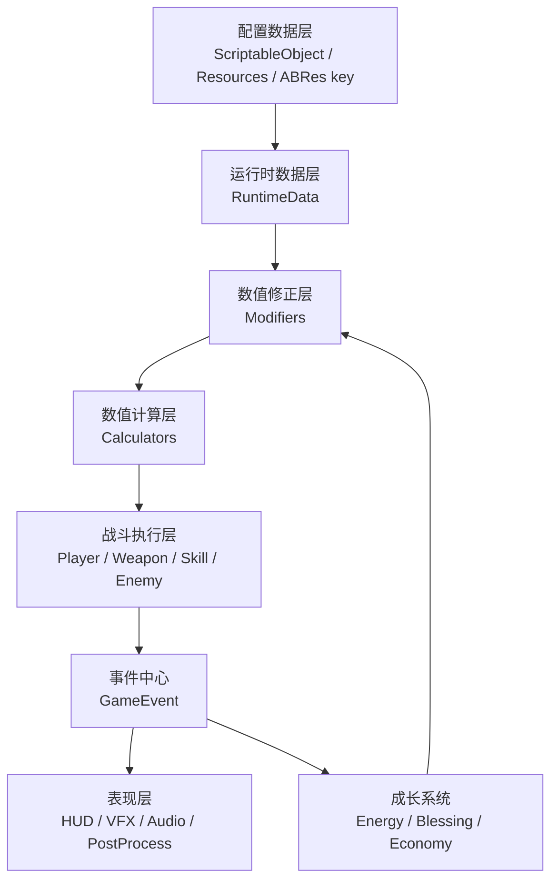

## 模块职责

| 模块 | 责任 | 不应该做 |
| --- | --- | --- |
| 配置数据层 | 保存基础数值、资源 key、默认规则 | 保存当前局临时状态 |
| 运行时数据层 | 保存当前局状态，例如当前能量、当前弹药、当前技能 CD | 反向修改配置资源 |
| 数值修正层 | 保存祝福、Buff、装备、局内成长带来的修正 | 直接播放表现或打开 UI |
| 数值计算层 | 把基础值和修正值合成为最终值 | 持有 UI 或场景对象 |
| 战斗执行层 | 使用最终值执行移动、开火、技能、受伤 | 自己生成祝福候选 |
| 事件中心 | 广播伤害、能量、升级、金币、技能等结果 | 保存业务状态 |
| 表现层 | 显示 HUD、伤害数字、音效、特效、后处理 | 决定最终伤害或成长数值 |
| 祝福系统 | 生成候选祝福、保存已选祝福、应用修正 | 直接改玩家或武器配置 |

## 数据分层

### 1. 配置数据

配置数据是局外静态数据，主要来自 `ScriptableObject`。

| 类型 | 示例 | 当前或规划来源 |
| --- | --- | --- |
| 玩家基础配置 | 生命、移动速度、跳跃参数 | `PlayerBaseConfig` |
| 武器配置 | 伤害、射速、弹夹、换弹、后坐力、开镜、表现 key | `WeaponConfig` |
| 技能配置 | 冷却、范围、伤害、击退、资源 key | `PlayerSkillConfig` |
| 敌人配置 | 生命、速度、伤害、动画状态、掉落 | `EnemyConfig` |
| 波次配置 | 刷新数量、权重、难度成长 | `EnemyWaveConfig` |
| 能量配置 | 最大能量、伤害转能量比例、是否自动升级 | `PlayerEnergyConfig` |
| 祝福配置 | 类型、等级、权重、效果、触发器 | `BlessingConfig` 规划 |
| 金币配置 | 金币倍率、掉落规则、结算规则 | `EconomyConfig` 规划 |

### 2. 运行时数据

运行时数据只服务当前一局，不写回资源。

| 类型 | 作用 |
| --- | --- |
| `PlayerRuntimeData` | 当前生命、临时玩家状态 |
| `WeaponRuntimeData` | 当前弹药、换弹状态、当前武器状态 |
| `PlayerSkillRuntimeData` | 技能 CD、技能数量、技能释放锁定 |
| `PlayerEnergyRuntimeData` | 当前能量、等级、是否可升级 |
| `BlessingRuntimeData` | 已选择祝福、堆叠层数、触发冷却 |
| `EconomyRuntimeData` | 当前局金币、金币倍率、掉落修正 |

### 3. 数值修正数据

祝福、Buff、装备和临时效果都应该落到修正层。

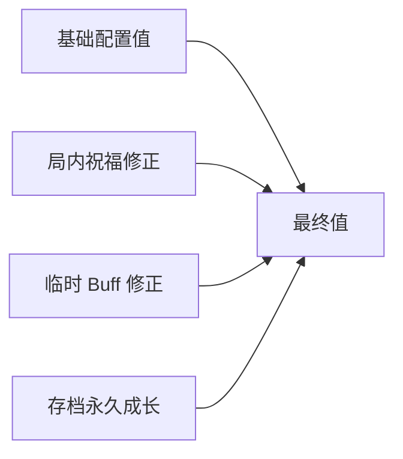

推荐统一修正结构：

| 字段 | 含义 |
| --- | --- |
| `targetType` | 玩家、武器、技能、金币、触发器 |
| `statType` | 要修改的数值 |
| `modifyType` | 加法、百分比加法、乘法、覆盖 |
| `value` | 修正值 |
| `sourceId` | 来源祝福或 Buff |
| `tier` | 祝福等级，用于追踪本次修正来自 Normal / Plus / PlusPlus |
| `stackCount` | 当前层数 |

## 数值计算顺序

建议所有最终值统一按这个顺序计算：

```text
最终值 = (基础值 + 固定加值) * (1 + 百分比加值) * 乘法倍率
```

示例：

```text
步枪最终伤害 = WeaponConfig.damage
            + 祝福固定伤害
            * 武器伤害百分比
            * 全局伤害倍率
```

这样每一种祝福不会互相乱覆盖，后续也方便做数值平衡。

## 祝福等级与数值修正

祝福等级属于祝福抽取结果，不属于能量系统本身。

能量等级负责影响抽取概率：

```text
Lv1 只出 Normal
Lv2 开始少量出现 Plus
Lv3 开始极少量出现 PlusPlus
Lv5 以后维持较高 Plus 概率和少量 PlusPlus 概率
```

祝福等级负责决定本次写入数值修正的强度：

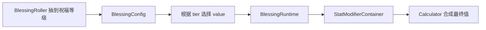

规则：

- `Normal / Plus / PlusPlus` 不创建三套战斗逻辑
- 同一个基础祝福可以有三档数值
- 叠层按基础祝福累计，等级只影响本次新增修正的数值
- 表现层只显示等级后缀和颜色，不参与数值计算
- 能量系统不直接决定最终 Buff 数值，只提供当前能量等级给祝福抽取器

## 玩家数值流

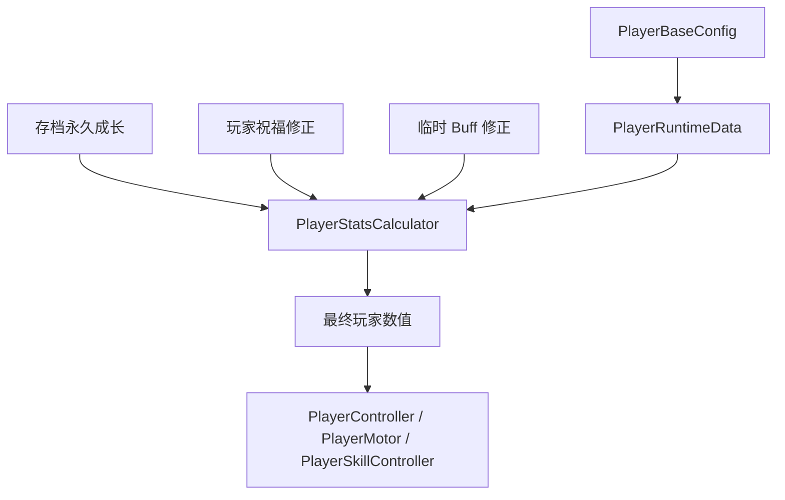

玩家数值包括：

- 最大生命
- 移动速度
- 受伤减免
- 能量获取倍率
- 闪避距离
- 无敌时间
- 金币拾取范围

## 武器数值流

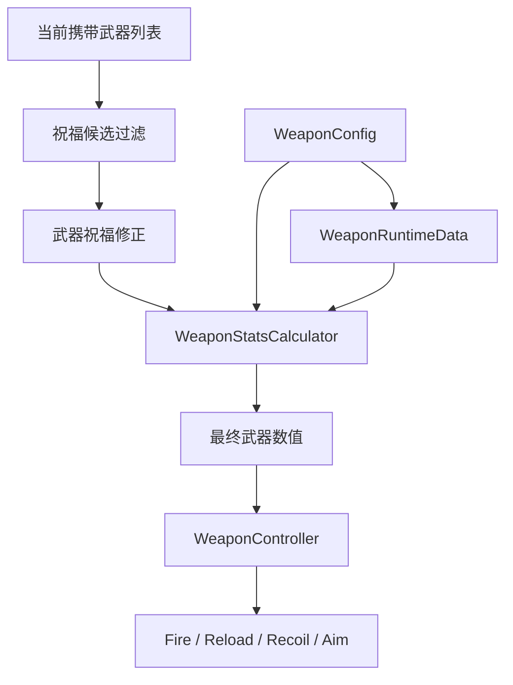

武器祝福生成规则：

- 只根据玩家当前携带武器生成对应祝福
- 手枪只生成手枪相关祝福
- 步枪只生成步枪相关祝福
- 霰弹枪只生成霰弹枪相关祝福
- 全武器祝福可以不限制武器类型

武器数值包括：

- 伤害
- 射速
- 弹夹
- 备弹
- 换弹速度
- 散射
- 后坐力
- 暴击率
- 暴击伤害
- 枪口表现强度

## 技能数值流

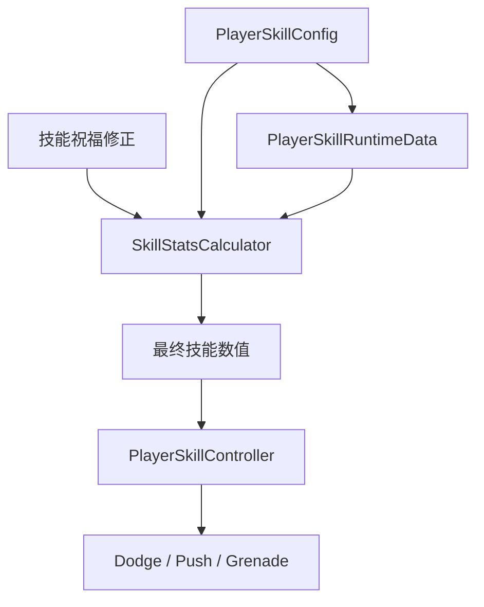

技能祝福示例：

- 闪避 CD 降低
- 闪避距离增加
- 推击范围增加
- 推击伤害增加
- 手雷最大数量增加
- 手雷爆炸半径增加
- 手雷冷却降低

## 能量与升级流

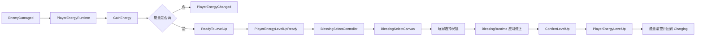

能量系统只负责：

- 获取能量
- 判断是否满
- 进入可升级状态
- 确认升级后清空能量
- 广播能量变化事件

能量系统不负责：

- 生成祝福候选
- 打开具体 UI
- 应用祝福效果
- 决定祝福稀有度

## 祝福系统架构

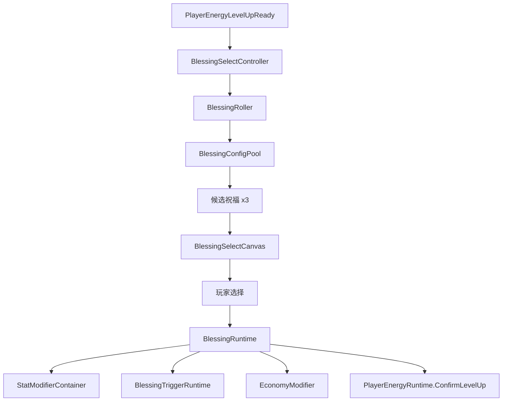

祝福分类：

| 分类 | 含义 | 示例 |
| --- | --- | --- |
| `PlayerStat` | 玩家数值型 | 最大生命、移速、减伤、能量倍率 |
| `WeaponStat` | 武器数值型 | 武器伤害、弹夹、射速、散射、后坐力 |
| `SkillStat` | 技能数值型 | CD、范围、数量、伤害、击退 |
| `GameplayTrigger` | 玩法强化型 | 开枪概率闪电链、击杀召唤物、暴击爆炸 |
| `Economy` | 金币获取型 | 金币倍率、精英金币、连杀金币 |

## 玩法触发型祝福数据流

玩法触发型祝福通过事件监听接入，不直接写在武器或技能代码里。

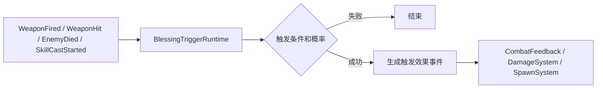

触发点建议：

- `OnFire`
- `OnHitEnemy`
- `OnCriticalHit`
- `OnKillEnemy`
- `OnReload`
- `OnDodge`
- `OnSkillCast`
- `OnPlayerDamaged`
- `OnWaveStart`

触发效果建议：

- 闪电链
- 小范围爆炸
- 召唤物
- 燃烧区域
- 减速区域
- 额外金币
- 临时攻速提升

## 金币数值流

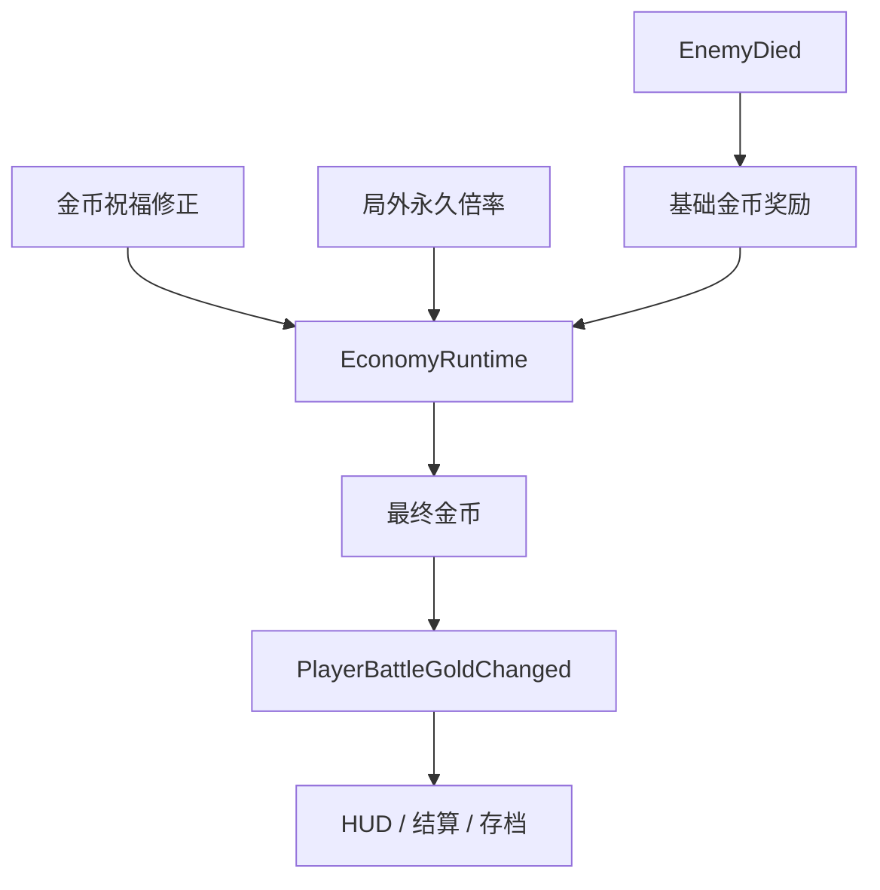

金币系统规则：

- 敌人只给基础金币
- 金币倍率在 `EconomyRuntime` 统一计算
- HUD 只显示结果
- 存档只保存局外金币和永久成长，不保存局内祝福

## 事件数据流总图

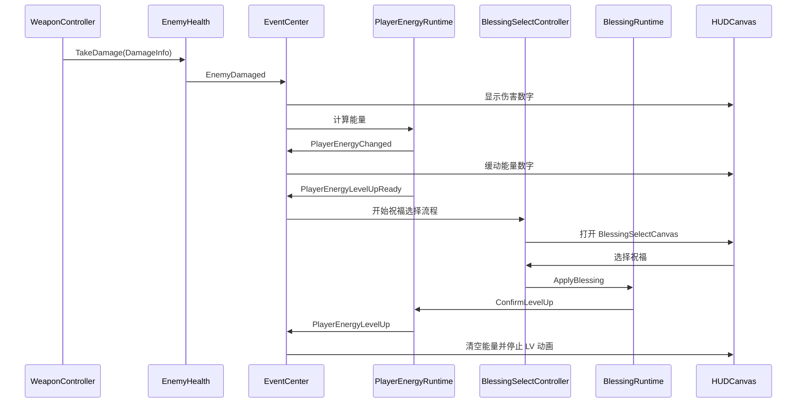

## 第一版落地顺序

1. 能量系统状态机
   - `Charging`
   - `ReadyToLevelUp`
   - `SelectingBlessing`
   - `Resetting`
   - `Locked`

2. 祝福基础数据
   - `BlessingCategory`
   - `BlessingTargetType`
   - `BlessingModifyType`
   - `BlessingTriggerType`
   - `BlessingConfig`
   - `BlessingConfigAsset`

3. 祝福运行时
   - 保存已选祝福
   - 保存祝福层数
   - 生成数值修正
   - 暂不做复杂触发效果

4. 祝福抽取器
   - 按波次解锁
   - 按稀有度和权重抽取
   - 根据玩家携带武器过滤武器祝福
   - 已满层祝福不再出现

5. 祝福选择流程
   - `BlessingSelectController`
   - `BlessingSelectCanvas`
   - 三选一
   - 选择后调用 `ConfirmLevelUp`

6. 第一批祝福
   - 玩家最大生命
   - 玩家移速
   - 能量获取倍率
   - 当前武器伤害
   - 当前武器弹夹
   - 手雷最大数量
   - 技能冷却
   - 金币倍率

7. 第二版再加玩法触发型
   - 开枪概率闪电链
   - 暴击爆炸
   - 击杀召唤物
   - 闪避后强化开火

## 当前边界规则

- `PlayerEnergyRuntime` 不直接打开祝福 UI，只触发事件
- `BlessingSelectController` 负责打开和关闭祝福选择 UI
- `BlessingSelectCanvas` 只负责显示和点击，不计算祝福
- `BlessingRuntime` 负责保存和应用祝福
- `WeaponController` 只读取最终武器数值，不关心祝福来源
- `PlayerSkillController` 只读取最终技能数值，不关心祝福来源
- `CombatFeedbackManager` 只处理表现资源，不参与数值计算
- `EnemyHealth` 只处理受伤和死亡，不参与能量和祝福计算

## 性能规则

- 祝福效果尽量在事件发生时计算，不要每帧遍历所有祝福
- 最终数值可以在祝福变化时重新计算并缓存
- 高频触发型祝福必须有概率、冷却和同屏上限
- 召唤物、闪电链、爆炸等表现必须走对象池
- 武器高射速时，触发效果需要节流，避免粒子和音效爆炸
- UI 只在事件变化时刷新，不每帧刷新动态文本

## 多会话分工

数据层会话：

- 设计 `BlessingConfig` 和默认祝福资源
- 设计数值修正结构
- 维护 `Docs/Data_Quick_Reference.md`
- 维护祝福权重、稀有度、解锁波次和资源 key

表现与控制层会话：

- 接入能量状态机
- 实现 `BlessingSelectController`
- 实现 `BlessingSelectCanvas`
- 接入玩家、武器、技能最终数值读取
- 接入触发型祝福的表现和对象池
